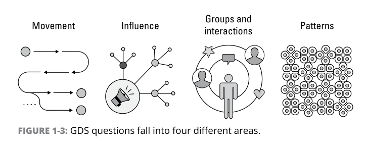

- a graph is a representation of a network,
- gain knowledge from the relationships and structures in data,

- graph statistic: number of nodes and distribution of relationships.
- graph analytics: gaining insights from connections
- Graph-enhanced ML and AI: train ML models or support probabilistic decisions

**Question types**: evaluate interdependencies, infer meaning, and predict behavior.

  - movement
  - influence
  - groups 
  - interactions
  - patterns

**Magor Aim**: better decisions, increased quality of predictions, and creating new ways to innovate and learn.

**Knowledge Graph**: streamline workflows, automate responses, and scale intelligent decisions. data relationships to derive new knowledge.

**Graph Analytics**: answer specific questions based on relationships and topology. Graph queries are used when you know exactly what you’re looking for. Louvain Modularity

  - Pathfinding and search
  - Centrality (importance), These algorithms infer group dynamics, such as credibility, rippling vulnerability, and bridges between groups.
  - Community detection: reveal tight clusters, isolated groups, and structures. predict similar behavior or preferences, estimate resilience, find duplicate entities, or simply prepare data for other analyses.
  - Similarity: properties and attributes of nodes are used to score the likeness between nodes. recommendations as well as developing categorical hierarchies.
  - Heuristic link prediction
  - Graph embedding: feature engineering, similarity calculations, or visualizations

**Graph feature engineering**, Graph feature engineering uses relationships and network structures to create new, more meaningful features.
Graph feature engineering offers organizations attainable model improvements without needing to change their ML pipelines.

**Graph Embedding** simplifies graphs or subsets of graphs into a feature vector or set of vectors, that are in a lower-dimensional form, such as a list of numbers. The goal is to create easily consumable data for tasks like ML that still describe more intricate topology, connectivity, or nodes attributes.
  - Node embedding
  - Path embedding
  - Graph embedding

**Graph networks**, with less data, make predictions more explainable, and lead to new types of learning itself. (Peter Battaglia)

**Neo4j as GDS platform**, (GDS lib, Graph database management system DBMS,  browser, bloom)

----
**ex, Fraud Detection**

- **remove outliers**, Degree Centrality Algorithm (gds.alpha.degree.stream), update node labels (bad) `SET n:BadPhone REMOVE n:Phone;` 
-  **Finding Suspicious Clusters**, Weakly Connected Components algorithm (gds.wcc.write), 
- **Bloom**, Betweenness Centrality algorithm (gds.betweenness.write), 
- **Predicting Fraudsters Using Graph Features**, » The betweenness centrality score » The number of clients sharing identifiers » The weighting of shared identifiers » The number of known mules within <n> hops » The size of clusters

---
**HOW to START**
**Investigate use cases and get comfortable with concepts**
- [review use cases](neo4j.com/use-cases)
- [watch talks](go.neo4j.com/connections-graph-data- science-lp.html)
- [Expand your knowledge of key concepts.](neo4j. com/whitepapers/artificial-intelligence-graph- technology)
**Identify and engage a spearhead team**

**Evaluate your “graphy” problem**, 
Consider hosting offsite or virtual innovation sessions with your cross-functional team to define your stakeholders’ needs, create connection-related questions,
story-board possible solutions, and identify key challenges and opportunities. uncover promising target use cases.
**Assess the current state**, out how your business sponsors view this use case, as specific as you can.
**Map the value of the proposed state**, 
how your graph target use case can help with business concerns
**Measure ROI**, measure your return on investment (ROI)
**Align stakeholders**
**Get your project approved**
**Conduct a POC and plan for production**, proof of concept (POC), Vendors that provide POC services can help accelerate your project with their graph experience. Visit neo4j.com/professional-services
**Get connected and continue your journey**, [graphacademy](neo4j.com/graphacademy.)

- benefit of using a graph for recommendation?