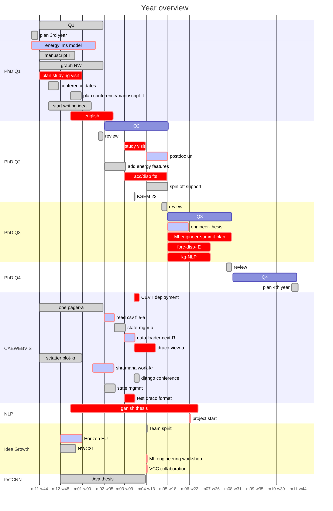

### Summary

#### PhD
- 1st submission of paper "energy fts simrank"
- Revision of "energy fts simrank"
- Extending SimRank
- Ontology paper for ICKG
- Physical Graph POC
  - grouping parts and features
  - generating graph
  - load-path detection
- Transfer DOE POC
  - implemented, [ICLR 2021 SimDL Workshop](https://github.com/bjd39/lupi-ndp))> was not relevant
  - generate 3 dataset with development three
  - plotly dash for prediction result 

#### Courses
- CS 224W, Machine Learning with Graphs
- CS 246, Mining Massive Data Set
- German intensive

#### Conference/workshop
- MarDI workshop
- ICKG
- SIMVEC
- PINN
- Wüppertal Consortium

#### Supervision
- Ava thesis, crash test CNN
- Ganish thesis faialed
- Duy, Curve clustring

##### CAE NLP
- SPHINx reporting
- EuroNCAP graph modelin
- Bubblenet safety extraction
- pagerank 
- bundle graph

##### CAEWebVis
- scatter plot view
- state management
- filtering
- upperleg
- lowerleg
- web component investigation 
- testing

#### Team Spirit
- ML for engineers with Nadja and Christian, 3 meeting
- NDV informal
- Book club
- reprocucability > Moritz Talk
- auto ML > Sebastian Talk

#### Colaboration init
- Tesla safety center
- GATD, supporting Amulya
- TUM, dudeck and 2 students
- EuroNCAP to publish the data
- Chalmers, HEU
- "Collarana Vargas, Diego", IAIS
- W3 community

--------------------------------------

Year Overview

-----------------------------------------------------------------------------------
- relay Ava's work and Ganish to my PHD?
  - Ava, add pid connection based on the auto-detection of labeling
  - Ganish, kg-NLP (more of his work than his thesis)
### Feedbacks
- like contribution to the team/good tem player
- Aiming for further than where we are/consider not to aim for too much
- good learning curve
- be careful on side topics to finish the PhD
- quality and quantity of work, good
- [ ] suspend in sharing viewpoint
- [ ] more english

### Find way
- code improvement, get feedback (How todo it/ time estimation)
- clear communication with students, this is just my way of working (plan and scheduling)

-----------------------------------------------------------------------------------

Meeting Notes

##### Knowledge Graph
- Manuscript, finished DOE fingerprint update
- domain-specific related work, [a survey](https://www.sciencedirect.com/science/article/abs/pii/S1084804521000990?via%3Dihub)
- Physically Well Defined Graphs,  Data analytics on graphs Part III: Machine learning on graphs, from graph topology to applications
  - need more graph theory, following material from 
- [Jurij Leskovec](https://profiles.stanford.edu/jure-leskovec?tab=teaching) courses
   - CS 224W, Machine Learning with Graphs, focus on the graph as NN, [videos](https://youtube.com/playlist?list=PLoROMvodv4rPLKxIpqhjhPgdQy7imNkDn), [info](http://web.stanford.edu/class/cs224w/)
   - CS 246, Mining Massive Data Sets, graph sections into understanding graph theory (old recording), [videos](https://youtube.com/playlist?list=PLLssT5z_DsK9JDLcT8T62VtzwyW9LNepV), [info](https://web.stanford.edu/class/cs246/)

- **lecture 30-34**, graph Laplace, 1st, 2nd, .. eigen values. 

##### CAE_NLP
- tested SPHINx for reporting, the question to IT to integrate the report on GitLab. 

- next, graph clustering and add nodes

##### CAE_WEB
- Meeting with Alex and Andre, no pipeline set up yet, manually built for better performance of node.js on deployment
- metadata for SEO should have been solved
- Raj and Karthik started (included Sara student as well), had a student day on Thursday. 3-hour workshop and together lunch, to go through the how-to and fast crash workflow and afterward continuing with Ganish and Ava support. 
- Positive feedback from Ava and Ganish on [available info](https://gitlab.scai.fraunhofer.de/anahita.pakiman/mission-statement/-/wikis/Students) for new students and Toby page, 

##### Test Pic CNN
- lamp+hatch data set, 1216
- cat+dog data set 25000
- image net, 14e6 images

###### Lamp-Hatch
- validation, 60% accuracy on none trained Image-net(res-net), removed last layer
- training, 100% accuracy 

- Realated work
  - getting 100% accuracy 
  - getting 60% on validation
  - norm of data size for res-net transfer learning
  - image rendering Techniques
- Make a data prescribtion
- Rendering photots
  - learn metapost
  - make photos for different cars

- 13th december, presentation for NDV

---------------------------------------------------------------------------

##### Knowledge Graph
- Last year review and plan for next year, [link](https://gitlab.scai.fraunhofer.de/anahita.pakiman/mission-statement/-/wikis/Overview/2021_2022)
- manuscript, 5th (Jochen) and 6th (joined with Axel) iteration. 
  - energy feature extraction on CEVT data, more diverse, parts with declining/negative IE, parts with no saturation in IE
- merging boxes with kmeans clustering and store in pandas data frame, a bug in merging
- NN summary in crash, [link](https://gitlab.scai.fraunhofer.de/anahita.pakiman/mission-statement/-/issues/127)
- Mining Massive Data Sets, PageRank, finding a similar set (singling, minhashing). Implementing PageRank on development tree

##### CAE_NLP
- summary of the page link graph of EuroNCAP
- testing graph clustering with eigen value calculation of the graph laplaceian matrix
- related work reading of enriching data with HTML structure (not using regex)
##### CAE_WEB
- Karthik, learning front end
- Raj, getting into backen code
- Ava, onepager view, on vacation from 26th Nov to end of December

##### Test Pic CNN
- Presentation on ndv-auto, 24th november
-----------------------------------------------------------------------------------

##### Knowledge Graph
- manuscript, implemented Axel input, link of [issues](https://gitlab.scai.fraunhofer.de/anahita.pakiman/mission-statement/-/issues/89)
- any better way to work in a group on latex?
- add link to cae_nlp, kg01, and caewebvis, on the learning from cae data
- merge boxes, done. **next** test it on a bigger model

percentage overlap

- detect boxes (cluster) with high overlap in longitudinal dir of impact
  - [x] does the clustering find them, yes
  - update check merge for it if clustering doesn't exist the or option for impact plane direction should change (will merge LHS, RHS component)

- Massive data mining course, **idea**, frequent items counting
- Finalized KG related conferences dates, [link](https://gitlab.scai.fraunhofer.de/anahita.pakiman/publication/-/blob/main/README.md)

##### CAE_NLP
- Get into using NETWORKX
- Evaluated wrong Laplacian matrix for the graph, will start with a small example 1st to understand the method

##### CAE_WEB
- Alex not additional support approx until Feb
- State management library benchmark
- graph visualization package, Graphin from antv
- karthik done with front-end learning, starting with simple modification
- Raj, went through backend API. Getting to know model compare
- Ava, onepager, can play video but problem with mp4 embedding

##### Test Pic CNN

##### Other
- Ml for engineers, [link](https://gitlab.scai.fraunhofer.de/anahita.pakiman/mission-statement/-/issues/123), summrizing so far discussion, still considering communication as a topic, next meeting 17th dec
- Redmine, task management, [link](https://gitlab.scai.fraunhofer.de/anahita.pakiman/mission-statement/-/issues/155)
- Lotus Tech (GATD) meeting with Amulya, needs help to define project until end of this year. Recommended making collaboration in geely group (CEVT, vcc, lotus) and including SCAI. Do we have a report of our ML methods? Looking into LUNAR MSC, Neural Concepts.

-----------------------------------------------------------------------------------
### 2021_12_01
##### Knowledge Graph 
- related work for recommending to sibling vehicles, [lik](https://gitlab.scai.fraunhofer.de/anahita.pakiman/mission-statement/-/issues/127#kohar2021), Lars Greve
- [overview of crash modeling](https://gitlab.scai.fraunhofer.de/anahita.pakiman/mission-statement/-/issues/127#noorsumar2021)
- challenge of latex template change (4 hr)
- Next month target, [link](https://gitlab.scai.fraunhofer.de/anahita.pakiman/mission-statement/-/issues/138#msg)
- Changing the schema for adding the grouping and aligning it with the manuscript

- merging energy features

##### CAE_WEB
* Do we need artyfactory > good for security, specific version on node.js, and node.js doesn't keep all the packages, artifactory make a local copy
* branch naming, in team work. feature_AB (name abbreviation), [github flow](https://stackoverflow.com/questions/3460897/git-workflow-everyone-has-a-branch-or-everyone-has-a-master/3461332#3461332), and look into versioning (Semantic versioning), conventional commits-webstorm
* front-end running without back-end, [API mocking library](https://miragejs.com/)> run mock server > return your own javascript, export const obj = {json file}

#### CEVT
* manuscript, send for review
*  vacation plan in dec, caewebvis, not in December ok in January
*  Tesla safety center, asking to get support for connection > still working at Tesla from Göbrg
*  info about concept studies at CEVT, martin svensson
*  connection with LOTUS geely, (GATD),
*  Ava thesis, use cx11 pedestrian real test, ok with picture and one model
*  presentation on week 6,7 at CEVT
*  workshop, delayed for now

-----------------------------------------------------------------------------------
### 2021_12_08
##### Knowledge Graph
- Mining massive dataset, registered on [stanfordonline](https://www.edx.org/course/mining-massive-datasets?index=product&queryID=16ee0d3850c519e53d1fed07b9285e85&position=1), the course is from 2016 but slides are updated
  - done with 1st-6th chapter and handed in assignment
- Study visit investigation, [link](https://gitlab.scai.fraunhofer.de/anahita.pakiman/mission-statement/-/issues/156). considering postdoc plan
  - EPFL
  - Tesla data center
  - crash-ml publication
- Manuscript
  - ssh failure
  - Axel no input
- crash modeling, [Noorsumar2021](https://gitlab.scai.fraunhofer.de/anahita.pakiman/mission-statement/-/issues/127#:~:text=with%20moving%20average-,Noorsumar2021,-Mathematical%20models%20for)
- Energy Modeling

##### CAE_NLP
- Ganish, finalizing page rank and graph Laplacian clustering report, time mgmnt issue for his work

##### CAE_WEB
- Alex, made a fast intro for mirage.js mokup server^
- Raj, still working on modeling scatter nodes (Sct), on vacation from 14th dec-10th jan
- Kathink done with mirage.js. start with 3d scatter frontend

##### Crash diversity
- made the first contact with oscarproject partners, [link](https://gitlab.scai.fraunhofer.de/anahita.pakiman/mission-statement/-/issues/131#osccarproject) 
- Addtional contact with Tesla lab project
------------------------------------------------
### 2021_12_15

##### Knowledge Graph
- mining massive data set, module 8-9(middle)
- The deadline moved from 1st January (edx error)
- manuscript, implemented itr7 feedbacks, meeting with Axel has no time for my supervision. Updated the related work
- energy features for grouped boxes, add FTS_GRP relation, for time better to use from part but for max_nrg, from the summation (grp_fts)

##### CAE_NLP
- Ganish, sick

##### CAE_WEB
- new API for filtering, should be done after state management
- Sphinx server on GitLab, should use GitLab-internal to be able to create pages
- Raj, almost done with scatter plot modeling
- Kathik, still working on 1st implementation of scatter plot, no result yet
- Ava, on vacation

##### Crash diversity
- Got contact of the relevant person in VCC and Chalmers, 
- additional [project virtual](https://projectvirtual.eu)
- No reply from BATs

-----------------------------------------------------------------------

### 2021_12_22

##### Knowledge Graph
- energy model, done with part sum and curve sum of features, summarizing the result with error bar
- merging energy features via curve, bug in the cypher query (collecting all pid connected to the Grp)
- mds course, module 8,9-assignment left, 10 mid
- Manuscript, update on figures and section 7
- Applied for the [ML with graphs](https://online.stanford.edu/courses/xcs224w-machine-learning-graphs)
- Manuscript, cevt approved the content, ask feedback from Mattias.
  - some additional work for simrank on CEVT data is needed
  - submitting in January before 10th

##### CAE_NLP
- Ganish is back to work
- Sphinx work on gitlab internal, why we are using gitlab external? 
- Finalized PageRank and Graph Laplacian report on EU-NCAP, I should investigate his work 
- Thesis, challenge of data, made a summary of available tools for extracting images, challenge with safety companion
  - @Jochen, has he asked Carhs?
  - he will check the crashworthiness book
- python sphinx, [example](https://gitlab-intern.scai.fraunhofer.de/gkolappan/statichtmlpages)
- [graph analytics report](https://gitlab.scai.fraunhofer.de/ndv/research/automotive/cae_nlp/-/blob/ganesh/EuroNcap_webscrapping/Networkx/Networkx_Summary.pdf), should he try to write a [conference ](https://gitlab.scai.fraunhofer.de/anahita.pakiman/publication/-/blob/main/README.md)paper or better to spend it on the project?

##### CAE_WEB
- Karthik done with scatter plot, loading random data, next load mocap values and finding multi select feature
- Karthik on vacation on 6th Feb-3rd March?
- Ava, Raj on vacation

##### Crash diversity
- meeting with Chalmers, [notes](https://gitlab.scai.fraunhofer.de/anahita.pakiman/mission-statement/-/issues/131#chalmers)

##### ML-engineering
- 3rd meeting with Nadja and Christian
- aim for the gathering in mid-summer, star planing from may
- Questioning the idea of why we need to arrange a workshop-what will be the difference. Targets: 
  - Exchange with other ML-engineer
  - support industry
    - dirty work, labeling data and culture of work3
  - Result talk for itself, understandable to management
  - add patience to support the engineering domain and not to give up
  - find the right question to answer
- Target group: studied engineering and couple of years experience in ML

**To Do**
- make a survey to send around
- contact Katrin Suder, help industry, start from the bottom
- NDV meeting presentation of the idea

-----------------------------------------------------------------------

### 2022_01_05

##### Knowledge Graph
- Manuscript itr 8 with Jochen and Axel
- interesting result for CEVT simrank, and debug the code [link](https://gitlab.scai.fraunhofer.de/anahita.pakiman/mission-statement/-/issues/158)
- Mining massive datasets, assignment 10 finished, course mid 12
- Graph modeling workflow

- load path detection 2d(right -left) and 3d (lower, mid, high) example with yaris model

##### CAE_NLP
 - piplie to auto-extract pdf files of EuroNCAP
 - spicy, ornage for enriching the data

##### CAE_WEB
- Ava, onepager video presentation is finished, started with upload option for the data
- Karthik, 3d scatterplot , still issue with box selection
- Raj, on vacation

-----------------------------------------------------------------------

### 2022_01_12

##### Knowledge Graph
- Working on the manuscript
- Mining massive datasets, assignment 11, 12 finished

##### CAE_NLP
- Ganish will have enough data for aut labling pdf piscture, resource from web-scralling pdf files on EuroNCAP page, 472 pdf, 8959 images
- should we try to write a paper? "EuroNCAP webscrawling for engineer"

##### CAE_WEB
- Ava, done with onepager, will have an update of CAEWEBVIS for VW meeting
- Raj, stuck in india
- Karthik, will skip vacation, scatterplot selection with 2d plot

-----------------------------------------------------------------------

### 2022_01_18

##### Knowledge Graph
- Manuscript finalized, looking for feedback [link](https://gitlab.scai.fraunhofer.de/anahita.pakiman/publication/-/blob/main/06_KG_energyAbsorption/KG_nrg_com_eng.pdf)
- load path detection, energy features for grouped parts, two methods comparison (total curve based and each part based), yaris submodel

##### CAE_NLP
- WIssenSafety, good resource, make connections to avoid double work
- Ganish thesis: feedback from Prof. Ploeger for required documents > 20k. Asked for related work
- asked him to look into [ksem](https://ksem22.smart-conf.net/) conference. 
- implemented scrapy and loading data to neo4j

##### CAE_WEB
- Ava, onepager including head impact animations are deployed, documented the deployment issues (updates required for Django, react, and static files management) > next learning writing test
- Raj is back to work, but issue with his laptop, not able to join the meeting
- Karthik, done with 2d scatterplot filtering and sending request to the backend -> next updating the 3d scatter accordingly
- meeting with VW, 4 people team at VW-pedpro, experienced since 2006, 
  - included, [Eichmueller, Georg Dietrich, Dr. (EXB/1)](georg.dietrich.eichmueller@volkswagen.de), [Alexander Besch](alexander.besch@volkswagen.de)
  - interested in curve comparison and similarity prediction, (new topic to them) 
  - rest, nice new technology but they already have solutions (not clear what they have)
  - next > follow up meeting, prioritizing comparing view to 3d visualization

##### Test Pic CNN
- producing new images with more components and different coloring

-----------------------------------------------------------------------

### 2022_01_26

##### Knowledge Graph
- Manuscript, final read
- Writing 2nd Manuscript, component detection and part grouping section
- Mining massive dataset, finished lecture 14 and 15, need to do the final exam to finish the course
- ESM (energy space modeling) > next convert this to physical graph

- start drafting the 2nd paper, [crash simulation as physical graph/ load path detection]( https://gitlab.scai.fraunhofer.de/anahita.pakiman/publication/-/blob/nrg_mdl/07_nrg_modeling/physical_graph.pdf)
- curve clustering, meeting with Rodrigo and Duy, should spend some time to submit more head impact simulations, in Feb

##### CAE_NLP
EuroNCAP KG
- result page, extract images, find structure of result > on progress, stored generic properties > storing images
- Bubblnet KG, the python language ois not free, Trying it with Java
- Issue with thesis, wish to merge work and thesis topic

##### CAE_WEB
- Ava, state management presentation, decided to explore recoile since it is developed by facebook (same developer as react)
- Ava, working on test writing, not  clear how to do it for neo4j + django
- Karthik, start with exploring state management with recoil
- Raj, collaborating in test writing but for scattering view

-----------------------------------------------------------------------

### 2022_02_02

##### Knowledge Graph
- Physical graph, written graph schema for grouping, and box grouping method
- Contacted TUM for collaboration based on the DSM paper, meeting with PhD student next week
- Part grouping test on the full model, not a perfect performance, algorithem needs debugging
- Finished the course 'Mining massive dataset'

##### CAE_NLP
- Ganish should register his thesis until end of February aim to have meeting with Prof. Ploeger in 3 weeks

##### CAE_WEB
- Ava, almost done with neomodel and djnago test, made a test database
- Karthick, started with implementing recoil and moving endpoints for getting result from database
- Raj, still low performance due to lack of personal laptop-----------------------------------------------------------------------

### [2022_02_09](https://gitlab.scai.fraunhofer.de/ndv/project_ndv/-/wikis/NDV-Automotive-Meeting/NDV-Automotive-Meeting_2022_02_09)

##### Knowledge Graph
- MII, writing introduction on physical graph
- Meeting with Tesla got canceled, Peter Winberg didn't show up

##### CAE_NLP
- enriching data, result pages have a list of images, **next** add Django template to visualize the images
- babbelnet RW how to download the knowledge graph, just possible to query the data> next summarize the RW and query classes and relations 
- thesis, half gone through with the proposal, problem definition and introduction is left 

##### CAE_WEB
- Ava, is done with testing the cypher model, however, this is not tested per application and should do further investigation/implementation on that
- Karthik, sick
- Raj, 
 - maintaining plan for 10 min presentation of Django 2021 conference, [timeplan](https://gitlab.scai.fraunhofer.de/ndv/research/automotive/caewebvis/-/issues/42#note_61850)
 - implemented scatterplot database on the /ndv/stud, next Karthik, Ava and raj together connect the backend and frontend
- This week 10 min presentation, Graphene in Django to be able to use graphql (instead of Django rest, swagger and JSON schema)

-----------------------------------------------------------------------

### [2022_02_16](https://gitlab.scai.fraunhofer.de/ndv/project_ndv/-/wikis/NDV-Automotive-Meeting/NDV-Automotive-Meeting_2022_02_16)
##### Knowledge Graph
- meeting with DSMs research team, [Volker A. Lange](https://www.epc.ed.tum.de/cm/mitarbeiter/externe-doktoranden/volker-andreas-lange/) and "Ascia, Paolo"   [more info](https://gitlab.scai.fraunhofer.de/anahita.pakiman/mission-statement/-/issues/156#tum)
- Writing introduction and component detection for physical graph paper
- ML with Graph course- done with colba1, colab2 70%,traditional graph embedding and page rank (classic, with reset and topic-specific), msg passing node classification, GNN
- Curve embedding- meeting with Rodrigo and Duy, next: relating embedding to impact position, embed only on an inner cluster of nodes
- The paper is finally submitted, [link](https://gitlab.scai.fraunhofer.de/anahita.pakiman/publication/-/blob/main/06_KG_energyAbsorption/submition/KG_nrg_com_eng.pdf)
- Coordination meeting planning 

##### CAE_NLP
- Babelnet summarizing related work and investigation knowledge extraction, Java language
- Finalizing the thesis proposal, intended meeting in next week

##### CAE_WEB
- Karthick will work until MARCh, joining IAIS for his R&D project > switch task to 3d mesh view
- Ava, the problem with javascript schema and test in Django
- Raj, investigating Graphene+graphQL instead of Rest > estimating the required time

##### Test Pic CNN
- looking into interpret-ability of result and writing the thesis
- Added augmented data and the performance is not 100% with noise

-----------------------------------------------------------------------
### [2022_03_02](https://gitlab.scai.fraunhofer.de/ndv/project_ndv/-/wikis/NDV-Automotive-Meeting/NDV-Automotive-Meeting_2022_03_02)

##### Knowledge Graph
- Meeting with "Collarana Vargas, Diego", IAIS > proposed to use graph embedding and then combine features for subgraph, and [pykeen](https://github.com/pykeen/pykeen) package, coming follow-up meeting
- 1st journal "engineering with computer" found the manuscript, not in their focus, got help from submission support, and transferred it to applied intelligence. 
- connect boxes to make physical graph

- Meeting with Axel about next stage of my work, writing book vs 3 paper
- Meeting with Tesla, knowing dual team in their development and still ongoing discussion to find a more relevant person

- MLG, finished the 2nd collab assignment-courses

##### CAE_NLP
- Meeting with Paul Ploeger, for Ganish thesis, need more brainstorming to clarify the idea
  - rule-driven approach > text keyword for picture
  - ls-Dyna manual > material to graph, find commonality of material model
- Euro-NCAP web-scrawling, made Django template to visualize all the pictures for each result page

##### CAE_WEB
- Ava implemented recoil, working on the upload feature. Contract extension?
- Raj, working on the endpoint for scatterplot view
- Karthik, working on Draco file

-----------------------------------------------------------------------

### [2022_03_09](https://gitlab.scai.fraunhofer.de/ndv/project_ndv/-/wikis/NDV-Automotive-Meeting/NDV-Automotive-Meeting_2022_03_09)

##### Knowledge Graph
- submited abstract for physical graph
- attend on Axel's student defense, crash box 2d optimisation
- Meeting with Diego from IAIS > structure data for GNN
- Graph ML course, finished colab 3 and started runing colab2 on leo1 (GNN instalation pipline)
- Considering sending abstract for ISWC [in-use track](https://iswc2022.semanticweb.org/index.php/in-use-track/) than industry or/and [doctoral-consortium](https://iswc2022.semanticweb.org/index.php/doctoral-consortium/), abstract due 28 April 2022, Full paper 5th may
- Raj discussion for thesis, investigating mass spring model as a graph prediction
- YARIS bumper study, loaded energy features to the graph data base, debugging the physical graph for just energetic part
  - 773 part -> 319 part
  - removed: facia, fender, side panel

- car to graph discussion in ndv-teamspirit

##### CAE_NLP
- debugged EuroNCAP images, all can be seen in django template but there isn't any lable available, just car and its photos

- babelnet, started to load the data locally
- **NEXT** develop classes for result page based on car specifiocation table, transfer data from node property to the graph structure (new nodes)

##### CAE_WEB
- Ava, working on load component to load data for the table and update on endpoints
- Karthik, need to split scatter view to 2 componnent and ready to support Angular development
- Raj, scatter plot endpoint

##### Test Pic CNN
- Ava's work for informed ML, she decided not to have a paper

-----------------------------------------------------------------------

### [2022_03_16](https://gitlab.scai.fraunhofer.de/ndv/project_ndv/-/wikis/NDV-Automotive-Meeting/NDV-Automotive-Meeting_2022_03_16)

##### Knowledge Graph
- YARIS_BUMPER, contact issue in the simulations not a good setup for GNN
- made a new submodel for GNN investigation, needs to discuss the change matrix
- meeting with Axel, replaning the work, starting with prediction of DOE than predicting the similarity > start with mass-spring modell than FE
- Talked with Mattias, engine deviation is less interesting it is more a question about the distrubuted mass change which also includes stiffness change
- Physical Graph writing, finalizing merged features for laod-path 

##### CAE_NLP
- Ganish struggle with understanding data modeling, but it is going forward. Asked him to have more frequent talks with Raj

##### CAE_WEB
- Load json is done, question is about how to handle the rest of data. Ava investigating local storage, can be an option for scale
- Karthick, done with spliting scatter plot component
- Raj, Ava, Karthick will deploy scatterplot 

##### Test Pic CNN
- still investigating on understanding the gradient for interpret-ability of result, 2nd feedback on the writing
-----------------------------------------------------------------------

### [2022_03_23](https://gitlab.scai.fraunhofer.de/ndv/project_ndv/-/wikis/NDV-Automotive-Meeting/NDV-Automotive-Meeting_2022_03_23)

##### Knowledge Graph
- related work for GNN use in predicting simulations, two article are interesting ([deepmind, Learning to Simulate Complex Physics with Graph Networks](Learning to Simulate Complex Physics with Graph Networks), [ICLR 2021 SimDL Workshop](https://github.com/bjd39/lupi-ndp))

- struggle with pyg on cluster
- how to set up run for python with mpi 
- Asked for a meeting with cevt to brain storm the application of next stage of the work

##### CAE_NLP
- Meeting with Prof. Ploeger, stil the proposal is not clear. Asked Ganish to put more focus on his thesis than the work to finalize the proposal
- had issue to understand how to setup two database with neo4j
- EuroNCAP data modeling has improved, maybe good if he present it to the team

##### CAE_WEB
- scatter plot work transfer issue, Ava still not happy with the code and Karthick-Ava colab not functioning well  
- Raj starting to merg the cragraph of modelcompare with caewebvis, not in django framework

-----------------------------------------------------------------------

### [2022_04_13](https://gitlab.scai.fraunhofer.de/ndv/project_ndv/-/wikis/NDV-Automotive-Meeting/NDV-Automotive-Meeting_2022_04_13)

##### Knowledge Graph
- working on, Meta-learning using privileged information for dynamics. replacing the displcaement with FE output.
- made a simple model, one crash box to pid but sequential in impact direction, **question**, use displacement-time to energy

##### CAE_NLP
- Ganish decided to do his thesis on UNI project, method development in NLP instead of applied NLP
- He is quite slow in understanding data modeling for web scrawling- EuroNCAP

##### CAE_WEB
- Ava finalizing scatter view
- Raj working on integrating car-graph of modelcompare. Working on YARIS data I prepared for Sgramana

### [2022_04_20](https://gitlab.scai.fraunhofer.de/ndv/project_ndv/-/wikis/NDV-Automotive-Meeting/NDV-Automotive-Meeting_2022_04_20)

##### Knowledge Graph
- extending  Meta-learning using privileged information for dynamics code with a class of FE configuration
- setup autogeneration of keyfile (python) with deviating the crashbox plate thicknesses
- debug the FE model, issue with added mass as a crush weight
**NEXT** set post processing and test the learning
- writing the component feature section, started with physical graph and reconstruction
- RW, generating mass spring for submodeling, **new application**

##### CAE_NLP
- done with initial modeling of result pages in EuroNCAP, next model in detail result
- Babelnet, done with loading data connected to passive safety, **next** add connection on 2nd hope for available nodes

##### CAE_WEB
- Ava, almost done with scatter view, missing link of 2d-3d selection, working on deployment
- Raj, merging shramana db and CAEWEBVIS, data uncompatible, moving data to match to CAEWEBVIS, next: merging my data model and after that start with simcompare

##### Test Pic CNN
- find the setup for setting the camera view to solve the focus for image generation
- working on light setup, issue with rear lamp is left

-----------------------------------
### [2022_04_27](https://gitlab.scai.fraunhofer.de/ndv/project_ndv/-/wikis/NDV-Automotive-Meeting/NDV-Automotive-Meeting_2022_04_27)

##### Knowledge Graph
- transferring DOE, error termination with spread of thickness change and impact mass. wide range of changes, implemented changes
  - 3 mm mesh
  - chamfer on the shape edges of the cross section
  - changing variables from t1,t2 (thickness of each plate) to ti , dt to have the changes dependent
  - edge-to -edge contact
- now it is stable, 
  - e2e nocntc: CCSA_2part_04, sample_03.key  >  2 err - time  ave: 24 sec, max 30 sec
  - e2e ncntc: CCSA_2part_05, sample_04.key  >  0 err  - time ave: 5 min max 15 min
- feedback meeting with Axel, one of the best feedback sessions, 
  - load path detection, changing the simple
  - simulation setup for transferring DOE, research question, what is the range of deformations functioning

- [simvec abstract](https://gitlab.scai.fraunhofer.de/anahita.pakiman/publication/-/blob/main/09_simvec_2022/abstract/simvec_caewebvis.pdf), presenting all our graph modeling, kg01, shramana, caewebvis.
- [ISWC Consortium](https://gitlab.scai.fraunhofer.de/anahita.pakiman/publication/-/blob/iswc/11_consortium_ISWC/consortium_ISWC.pdf), probably skip due to hybrid, other [options](https://gitlab.scai.fraunhofer.de/anahita.pakiman/publication/-/blob/main/README.md)

##### CAE_NLP
- Ganish is off this week, contract change and additional hours
- EuroNCAP data modeling struggle, thinking to stop data modeling with him and focus on NLP and transfer the data modeling to Raj, with in a month

##### CAE_WEB
- Ava setting up the code on ndv/stud
- asked student to keep working on ndv/stud than local that we can access the servers
- Raj done with data modeling schema for merging 3 databases
- the web student hasn't replied, can we have a presentation at software program to find students?

##### Todo
- Raj meeting to transfer pedestrian data, to make a database (instead of moc data)
- SIMVEC submission
- find the kG conference
- model welds for ModelCompare
- load path detection, writing
- DOE transfer, 
  - set post processing
  - 1st test on IE 
- 1st quarter meeting 
-----------------------------------
### [2022_05_04](https://gitlab.scai.fraunhofer.de/ndv/project_ndv/-/wikis/NDV-Automotive-Meeting/NDV-Automotive-Meeting_2022_05_04)

##### Knowledge Graph
- submitted SIMVEC [abstract](https://gitlab.scai.fraunhofer.de/anahita.pakiman/publication/-/blob/main/09_simvec_2022/abstract/simvec_caewebvis.pdf)
- post processing is finalized, energy, video 
- load data to kg01 database on neo4j
- set nrg_dash to visualize the data

- 1st learning on the IE, not learning the nonlinearity, but good 1st result. 10 simulation changinf thickness of one part.

##### CAE_NLP
- laoded the values of EN on releationship
- discussed keeping result page and vehicle as double node
- loaded 2nd relationship of bubblenet

##### CAE_WEB
- the new applicant replied and will wait one more week, she has had a personal problem
- new [caewebvis](https://caewebvis.scai.fraunhofer.de/) is deployed
- Raj started with reading xml file from the input header to load the databse

##### Other
- weld/adhisive samples, datapath: `/home/ndv/stud/data/VENZA/full_model`, model change summary: `.\venza_model_change.pptx` 

##### TO DO
- [ ] get ti, tn values from db
- [x] torch instead of next, visualize all predictions
- [x] understand torch model, read the article as well
- [x] check the check_init function
- [x] solving the tensor issue for multi change in the code
- [x] learn pytorch debugging model, Moritz, taking an in depth look at the [Python profiler]( https://pytorch.org/tutorials/recipes/recipes/profiler_recipe.html) is probably a good idea. Other then that the default [debugger pdb ]((https://docs.python.org/3/library/pdb.html) should work.
- [x] predicting the non-linearity
- [ ] Finding size of required data
-----------------------------------
### [2022_05_11](https://gitlab.scai.fraunhofer.de/ndv/project_ndv/-/wikis/NDV-Automotive-Meeting/NDV-Automotive-Meeting_2022_05_11), [2022_05_18](https://gitlab.scai.fraunhofer.de/ndv/project_ndv/-/wikis/NDV-Automotive-Meeting/NDV-Automotive-Meeting_2022_05_18)

##### Knowledge Graph
- Physical Graph manuscript writing

- predicting the non-linearity, 
  - normalizing the time and IE with KE made it to predict nonlinearity

| 10 simulation, t1,  epoch 100 | 300 simulations, t1, epoch 100 |
| ------ | ------ |
|  |  |

- solve the issue with multi variables training
  - 10 simulation, t1, t2 changing, epoch 300

###### Understnd the model
- ordinary differntial equation, ODE > Neural ODE, NODE > Neural ODE process, NPD > Learning using privileged information, LUPI-NPD
- Neural Process NP, Garnelo2018 > combining kernel gaussian method with NN. capable of 
  - adapting to new data
  - estimate uncertainity in their prediction

  - Context data: learn from it (training), n
  - target data: for test predicting y, n+m
  - aggregation: mean
  - more context, the sampled curves increasingly resemble the ground truth curve and the overall variance is reduced.

##### CAE_NLP
- EuroNCAP modeling, status relationship, the difference between different year regulations, update needed on discipline nodes and multi-label node of vehicle/result page
- bubblenet, result on "Automotive safety" network, high deviation of degree, but pagerank doesn't find critical keywords

##### CAE_WEB
- caewebvis update FE,BE selected and loaded simultions 
- simulation loader, feed keyfile to the database for coloring the scatter plot view
- Ava hesitating to time report, started from this [week](https://gitlab.scai.fraunhofer.de/ndv/research/automotive/caewebvis/-/wikis/Student/Ava-Sharafi#time)
- Interviewing 1 students, Jimmy [web page](https://www2.inf.h-bonn-rhein-sieg.de/~jziwo2s/index.html)
  - started with investigation on micro front-end, need feedback form CAVIT
- Raj 1st result for reading .key file header and making si, model node
- Duy presentation for curve clustering, joint work with Raj in coming week
- student, one canseled intervies, two hasn't reply on the task

##### TO DO
- [ ] Conference review on ICMLA and ICKG
- MIII
  - [ ] get ti, tn values from db
  - [x] Finding size of required data
  - [x] Study effect of context and target points on the learning > not working
  - [ ] RW on transfer learning for simulations > graph weight prediction
  - [ ] start writing- introduction done > model setup
- MII
  - [ ] Implement complex graph code for physical graph

-----------------------------------

### [2022_05_25](https://gitlab.scai.fraunhofer.de/ndv/project_ndv/-/wikis/NDV-Automotive-Meeting/NDV-Automotive-Meeting_2022_05_25)

##### Knowledge Graph
Link weight prediction
 - make graph in networkx
    - make simulations.
    - load to neo4j
      - with current reader
      - add Pltf, Ubody, Veh, Model_Model, Atr nodes
      - run metapost and test app.py

- the GNN setup for learning
- 

- additional nodes for Pltf, Ubody, Atr
- 

- new set of data with development tree
  - start with a single node
  - random numbet to choose number of branches
  - make sim nodes
  - random number to set active branches
 

| m3    | No. sim | Study        | keyi          |
| ----- | ------- | ------------ | ------------- |
| 0.08  | 300     | TL2PID_12    | sample_05.key |
| 0.96  | 300     | TL2PID_12_02 | sample_05.key |
| 0.112 | 300     | TL2PID_12_03 | sample_05.key |
| 0.576 | 300     | TL2PID_12_04 | sample_05.key |

##### CAE_NLP
- Done with EuroNCAP modeling > node2vec to find similar vehicles
- Looking into litreture how to for keywording

##### CAE_WEB
- questions with web component, support from bio?
- raj struggle to match the code to expectation

##### TO DO
- [ ] conference paper for IEEE ICKG-deadline end of July. **ONTOLOGY for cargraph**
- [x] transfer neo4j data to Networkx 
- [ ] data from networkx to DeepSNAP
- [ ] 1st training on weight prediction
- [ ] prepare 18th review with Axel
- [ ] continue writing of MII and MIII

-----------------------------------

### [2022_06_01](https://gitlab.scai.fraunhofer.de/ndv/project_ndv/-/wikis/NDV-Automotive-Meeting/NDV-Automotive-Meeting_2022_06_01)

##### Knowledge Graph
- Loading the 4 setup simulations to energy dash.

- adding 2 more setup

- Final schema

- Query the data to Networkx

- Finalized the physical graph, looped 

- Automotive Ontology RW
  - [Automotive ontology working group](http://www.automotive-ontology.org/)
    * [AUTOMOTIVE AND TRANSPORTATION AT W3C](https://www.w3.org/auto/)
       * [Automotive Ontology Community Group, W3C](https://www.w3.org/community/gao/), 2015
       * [GRAPH STANDARDIZATION BUSINESS GROUP](https://www.w3.org/community/graph-standardization/), 2019
    * AUTO, [Automotive Ontology](https://github.com/edmcouncil/auto), built upon the auto schema.org extension created by the W3C Automotive Ontology Community Group. AUTO's development process follows the best practices established by the EDMC FIBO Community, 2019
     * [GAO Core-WebSchemas/Vehicles](https://www.w3.org/wiki/WebSchemas/Vehicles): A schema.org-compliant fundamental ontology for vehicle information in e-commerce

##### CAE_NLP
- Bundle graph, for Babelnet Automotivesafety

##### CAE_WEB
- Raj, still working on database loader of keyfile and status values
- Ava, almost done on FE filtering, some progress on componentweb
- Students, Plan to have the interview within 2 weeks, ask Mandar and Ava to send the new assignment

##### TO DO
- [x] vacation :smile: 
- [ ] conference paper for IEEE ICKG-deadline end of July. **ONTOLOGY for cargraph**
- [x] data from networkx to DeepSNAP
- [ ] 1st training on weight prediction
- [x] 18th review with Axel 
- [x] continue writing of MII and MIII

-----------------------------------
### [2022_06_08](https://gitlab.scai.fraunhofer.de/ndv/project_ndv/-/wikis/NDV-Automotive-Meeting/NDV-Automotive-Meeting_2022_06_08)

##### Knowledge Graph
- load path detection, 300simulation from Jens Trilling

- networkx to deepsnap
  - edge-level task
  - data split, train / val / test
  - type of split: transductive, training, validation and test splits include all the graph(s) in the dataset.

- [ ] figure out how to do the training
  - [x] add feature to node/edge
  - [x] add label to the graph 
  - [ ] hetrogenous training on the graph, works with Des, Part. issue with adding Sim. trying to find out the issue
  - [ ] investigate the prediction
-[ ] read-write graph dataset for leo training

##### CEVT
- asked for comments data section forces curve, Dag will bring it up to the group meeting. 

##### TO DO
- [x] Ava thesis review
- [x] Venza model
- [ ] Ontology paper
- [x] Link prediction on vehicle network

-----------------------------------

### [2022_06_15](https://gitlab.scai.fraunhofer.de/ndv/project_ndv/-/wikis/NDV-Automotive-Meeting/NDV-Automotive-Meeting_2022_06_15)

##### Knowledge Graph
###### Load Path Detectionn
  - initial example, there is no component

  - meeting with Jens Trilling, he can't add constrain to the model. I think it is best I do the modeling my self. 2-3 working day, then Axel contribution to the paper will be questioned.

###### Transfer DOE
  - hetrogenous training on the graph, works with Des, Part. issue with adding Sim. trying to find out the issue, problem was with not having any Sim node in the tail the hetroconv forward msg was failing to add the sim node to the node type for the embedding. Several option to solve it, 
    - multi dir on NRG_PART edge
    - re direct the graph structure that the sim is not only source.
    - predicted weights are making no sense

- hetrogenous node embedding, issue to set data for the training, its example wasn't following deepsnap. removing Des and Veh nodes. Des is taken care with part connettivity, model are common for different veh > pause hetero embedding idea, don't know how to do it unsupervised
- homogeneous node embedding, deepsnap example in pyg is also for suppervised
- started with the course workshops, using negative sampleing for unsuppervised, first result with onl nn.Embedding- no node feature

###### Ontology
- Deciding on the paper structure
  - focus on graph modeling
  - reviewing available ontology and connecting to our prefered one
  - two usecase of our modeling, EuroNCAP and CAE data
- Realized intro should start from domain, struggle to find out a good reference for CAE history in automotive industry
- Introduction 70% done

##### CAE_NLP
- Ganish, 
- done with dynamic visualization of Babelnet, with plotly graph objects

##### CAE_WEB
- Raj, code is structured modular per simulation for reading key file header, removing hard code from the statusparameter reading
- Ava, 
  - done with developing filtering, started with upperleg visualization.
  - react web component, error
  - investigating veu.js

##### Other
- Venza model for weld, 
  - model is runing with duplicate solids
  - ansa duplicate doesn't find the solids
  - used paste node features, withing for feedback 

##### Test Pic CNN
- Struggle with Ava thesis,
  - post poning the meeting to get feedback from his suppervisor
  - refusing to implement feddback from my side, the application is not well defined. 

##### TO DO
- [ ] Ontology paper-related work
- [ ] node embedding as unsuppervised learning
- [x] presentation for Axel workshop
- [x] 2 days at wuppertal uni

-----------------------------------

### [2022_06_22](https://gitlab.scai.fraunhofer.de/ndv/project_ndv/-/wikis/NDV-Automotive-Meeting/NDV-Automotive-Meeting_2022_06_22), [2022_06_29](https://gitlab.scai.fraunhofer.de/ndv/project_ndv/-/wikis/NDV-Automotive-Meeting/NDV-Automotive-Meeting_2022_06_29)

##### Knowledge Graph
###### Transfer DOE
- use this setup with GNN instead of nn.Embedding(shallow embedding) and negative sampling labling in deepsnap.

| m3    | No. sim | Study        | keyi          |
| ----- | ------- | ------------ | ------------- |
| 0.08  | 300     | TL2PID_12_01 | sample_05.key |
| 0.112 | 300     | TL2PID_12_02 | sample_05.key |
| 0.25  | 300     | TL2PID_12_03 | sample_05.key |
| 0.35  | 300     | TL2PID_12_04 | sample_05.key |
| 0.576 | 300     | TL2PID_12_05 | sample_05.key |
| 0.96  | 300     | TL2PID_12_06 | sample_05.key |

- needed graph for learning, the msg passin gis not simillar for all nodes

- decided to do a simple NN

- epochs:50, batch_size:4, learning_rate:1e-3

|  veh  |         tpred on itsel            |          trained on veh 40%      |  m3  |
| ----- | --------------------------------- | -------------------------------- | ---- |
|   01  |  Acc: 98.3%, Avg loss: 0.000576   |  Acc: 97.9%, Avg loss: 0.000864  | 0.08 | 
|   03  |  Acc: 96.3%, Avg loss: 0.002737   |  Acc: 92.2%, Avg loss: 0.008720  | 0.112| 
|   05  |  Acc: 93.0%, Avg loss: 0.007697   |  Acc: 89.0%, Avg loss: 0.019432  | 0.25 | 

###### Wüppertal Consortium
- presented the status of the work
- biggest interest so far in introducing similarity measure for simulations
- probable colaboration with Thorsten Pohl

###### Ontology
- done with EuroNCAP data modeling

- Stuggle with Shramana modeling

##### CAE_NLP
- an update of graph modeling and web_scrawling is needed
- still struggling to make a good visualization of pagerank result for bubblenet
- basic toturial to learn nod2vec analysis

##### CAE_WEB
- Ava
  - initial visualization of upperleg is done > next integrating it to the table.
  - issue with impleneting CAE-WEB so many option to set up, need support to guide
  - vue.js, the plotly package is not as stable as react. will start with some toturial
- Raj,
  - data workflow, issue to load data on the server
  - deploying key file loader to caewebvis, work around copying the database
  - merging nrg feature graph to CAEWEBVIS

##### TO DO
- [ ] Continue on the ontology paper
- [ ] Preparation for 12th review
- [x] Is simple-NN good enough? 
- [ ] using acceleration, time for simple-NN
- [x] 2 days vacation
- [x] interview web students

-----------------------------------

### [2022_07_06](https://gitlab.scai.fraunhofer.de/ndv/project_ndv/-/wikis/NDV-Automotive-Meeting/NDV-Automotive-Meeting_2022_07_06), [2022_07_13](https://gitlab.scai.fraunhofer.de/ndv/project_ndv/-/wikis/NDV-Automotive-Meeting/NDV-Automotive-Meeting_2022_07_13)

##### Knowledge Graph

###### Transfer DOE
- hyper parameter tuning, final result, epochs:50, learning_rate:1e-3

| Study-m3 | 01-  0.08 | 02- 0.112  | 03- 0.25|
|-----|---|------|----|
| batch_size:2,  5 layer with 100 node | Acc: 99.2%, Avg loss: 0.000150 |Acc: 98.5%, Avg loss: 0.000617 | Acc: 97.4%, Avg loss: 0.001610 |
| batch_size:4,  4 layer with 200 node | Acc: 98.3%, Avg loss: 0.000576 | Acc: 96.3%, Avg loss: 0.002737  |  Acc: 93.0%, Avg loss: 0.007697|

 

----------------------------------

----------------------------------
- no thickness as input

----------------------------------
- debug the dataset for the prediction.
- comparing including the 2nd vehicle data as transfering the model or used in the training.
 

- a meeting with Sara, probably it worth trying to 
  - set msg passing aggrgation based on edge type
  - using graph vs simple-NN, graph will be more efficent in data storage
  - modifying loss function of edge prediction to convert it to edge weight prediction
  - have a talk with "Sophia Krix" <sophia.krix@scai.fraunhofer.de>;

###### Ontology
- 1st feedback from Jochen, still a bit confused with how and why for ontology
- CAE data model

- Done with the first draft
- interested in eclipsecon-2022, based on OpenPASS presentation 

###### Physical Graph
- combine energy features with connectivity graph. Simple calcluttion of edge weight. sum(IE-dt/degree) for nodes of eadge 

|  |------------------ componen ----------------------------------- open ----------------------------------- looped ------------------ |
| ------ | ------ |
| COG position |  |
| IE_dt weighted |  |
| IE_dt weighted with position |  | 
| IE_dt weighted with position and distance  |  |

##### CAE_NLP
- update on the graph based on the Ontology paper
- loaded missing vehicle
- babellnet visualization, issue with positioning of the nodes after resizing the node pased on the page rank

##### CAE_WEB
- Raj, issue to access the CAEWEBVIS > solved
- `/home/ndv/stud`, access issue for employee to start neo4j server
- Ava, mostly done with lowerleg and upperleg > next select feature to connect to other components, no work on web-component
- new student for CAE-web, probable starting 4-8 week.

##### TO DO
- [x] Ontology papare final revising
- [x] Transfer DOE baseline study
- [ ] Transfer DOE, hetro graph msg passing
- [x] PhD 18 review prepration
- [ ] physical graph, reverse page rank calculation
- [ ] physical graph, node2vec vs GNN-graph embedding

-----------------------------------

### [2022_07_19](https://gitlab.scai.fraunhofer.de/ndv/project_ndv/-/wikis/NDV-Automotive-Meeting/NDV-Automotive-Meeting_2022_07_19)

##### Knowledge Graph
- Work in progress on Ontology paper
- PhD 18 review prepration
  - data for load path detection > better to use morphing and thickness changes
  - load path detection, what is a good result
  - Transfer DOE > add a basleine from direct use of transfer learning than mixing data, visualize actual vs prediction

- includ l sim of target prediction in training

- transfer learning with l simulation

##### CAE_NLP
- Work transfer from Raj to Ganish, issue to setup berkeley path
- loading pdf portocls to the data modeling

##### CAE_WEB
- Ava is sick
- Raj on leave due to exam

##### TO DO
- [x] Ontology papare final revising and submition
- [x] vacation Friday,monday
- [ ] Transfer DOE, hetro graph msg passing > paused
- [ ] physical graph, reverse page rank calculation
- [ ] physical graph, node2vec vs GNN-graph embedding

-----------------------------------

### [2022_07_27](https://gitlab.scai.fraunhofer.de/ndv/project_ndv/-/wikis/NDV-Automotive-Meeting/NDV-Automotive-Meeting_2022_07_27)

##### Knowledge Graph
- Transfer DOE related work.
  - Approach and application to transfer heterogeneous simulation data from finite element analysis to neural networks
  - Transfer learning enhanced physics informed neural network for phase-field modeling of fracture
  - Deep autoencoder based energy method for the bending, vibration, and buckling analysis ofKirchhoffplates with transfer learning
- car-graph ontology,
  - writing the paper
  - contacting EuroNCAP for colaboration and releasing the data model
- Physical Graph, adding impact direction to adjust the directed edges

##### CAE_NLP
- Ganish is done with updates on EuroNCAP to align it with the graph modeling paper
- asked him to present his thesis to us

##### CAE_WEB
- Ava, focused on her thesis
- Raj, off due to his thesis

##### TO DO
- [x] Ontology papare final revising and submition
- [x] Transfer DOE, write related work
- [ ] car-graph, project extention proposal
- [x] physical graph, reverse page rank calculation
- [ ] physical graph, node2vec vs GNN-graph embedding
-----------------------------------
### [2022_08_03](https://gitlab.scai.fraunhofer.de/ndv/project_ndv/-/wikis/NDV-Automotive-Meeting/NDV-Automotive-Meeting_2022_08_03)

##### Knowledge Graph
- submitted the car-graph modeling to ICKG 2022

###### Transfer DOE
- writing related work, 
  - CR(connection rate), "marco schauer" <marco.schauer@volkswagen.de> VW; 
  - more layer, less nodes in each layer
  - mostly based on deformation
  - mentionrd can't ensure NN learn the physics by itself and nead PINN, (Transfer learning enhanced physics informed neural network for phase-field modeling of fracture) with no reference?, however in macro, the NN is also not PINN.
  - 
- inreasing the number of input from IE curve, sample 3, 8 point between ti and tn
- introducing nes nodes ad Mthd with weighted edge of fts, that the flatten feature will be store on the edge and the method specification on the node.
- better to sample with split of delta IE, but still some time step dont exist.

###### Load Path Detc
- reverse page rank, leakage calculation > start from deadend. works well for component graph 
- challenge with loop and open graph, getting nan on the edges.

##### CAE_NLP
- Ganish, working on implementing node2vec for assessing vehicles, loaded wrong nodes and edges

##### CAE_WEB
- Raj, not working due to his exams
- Ava, started working and hand in her thesis, starting with curv view for Lowerleg, more complexity 

##### Car-graph 2.0
- talked with Sebastian, challenges of proposal and multi partners

##### TO DO
- [ ] Transfer DOE, write related work, revise the chapter
- [ ] physical graph, reverse page rank calculation, 
   - [ ] solve it for open and looped
   - [ ] try iterative method based on revising the unbalance distribution
- [ ] physical graph, node2vec vs GNN-graph embedding
- [ ] car-graph, project extention proposal
- [ ] find another connection for EuroNCAP colaboration

-----------------------------------
### [2022_08_10](https://gitlab.scai.fraunhofer.de/ndv/project_ndv/-/wikis/NDV-Automotive-Meeting/NDV-Automotive-Meeting_2022_08_10)

##### Knowledge Graph

###### Load path detection
- debugged NAN for looped and open graph > looped graph result is not physical 
- defined error based on IE = Flow_out- Flow_in
- debugged, 
  - nodes with multi out edge that not all has values delayed in the calculation
  - get flow of all out edges vs prevous active nodes

###### Transfer DOE
- brain strom on going with Sebastian, helped to improve formulating the problem. outcom:
  - split test, train data in visualization
  - IID (identically independent distribution) problem in the training data
  - considering permutaion or combination

- writing related work
- preparing training with more features

###### Consortium
- Corina Klug, HBM4VT
- safetywissen
  - Dirk Ulrich > Rainer Hoffmann and Alexander Hoffmann
  - info
- EuroNCAP
  -general contact
- W3 > automotive working group > peter winzell- vcc, dominik rost-fraunhofer iese
- Collarana Vargas, Diego iais

##### CAE_NLP
- Ganish, off

##### CAE_WEB
- Raj, off
- Ava, 
  - initial implementation of the web_component > requested detail report to see the difference
  - statusview filtering, issue with autosizing table when number of row is differing > investigating the CSS, adjustable layoutsetting /plotly issue

##### TO DO
- load path, 
  - [x] resolving looped graph issue
  - [ ] implement embedding for the path and visualiyation
  - [ ] set up more complex example 
- Transfer DOE
  - [x] continue related work
  - [x] run the training with convergunce curve
  - [x] spliting test, train data in visualization
  - [ ] considering permutaion or combination
-----------------------------------
### [2022_08_16](https://gitlab.scai.fraunhofer.de/ndv/project_ndv/-/wikis/NDV-Automotive-Meeting/NDV-Automotive-Meeting_2022_08_16)

##### Knowledge Graph
###### Load path detection
- Energy flow, solved with removing double-sided edges, no issue with looped graph
- restruct code, add test.py to the project, `pytest`
- Use longets path for visualizing the path
- add symmetry edges
- post result for four submodel simulation

###### Transfer DOE
  - Done with related work, [link](https://gitlab.scai.fraunhofer.de/anahita.pakiman/publication/-/blob/trf_doe/10_transfer_doe/transfer_doe.pdf)
  - training with more features
  - run the training with convergunce curve, tensorboard, for epoch- sum/avrg

  - issue to plot accuracy-predicted with tensorboard
  - spliting test, train data in visualization
  

###### Consortium
- safetywissen > Rainer Hoffmann, meeting in coming weeks
- EuroNCAP,  Aled Williams > +44 7795 106153 > no reply
- HPI, Ralf Krestel, crashnet paper main by PAG ( Maximilian Rabus,  Mohamed Karim Belaid) > no automotive

##### CAE_NLP
- challanged to filter node types
- will end his work 1st week of october

##### CAE_WEB
- Raj, start to work from Tuesday > tasks from Ava to catch up with FE
- Ava,
  - solved layout issue
  - web component, progress to know what deviates from react, but it seems if we have structured with react differently it would have been easier to map

##### TO DO

- load path, 
  - [x] adjust edge feaure to combine with time

  - [ ] implement embedding for the path and visualization
  - [ ] set up more complex example 
  
- Transfer DOE
  - [x] considering permutaion or combination
  - [ ] change artitecture
  - [x] use only dev tree
- Consortium
  - [ ] prepare presntation for cargraph 2.0
- [x] vacation-----------------------------------

### [2022_08_31](https://gitlab.scai.fraunhofer.de/ndv/project_ndv/-/wikis/NDV-Automotive-Meeting/NDV-Automotive-Meeting_2022_08_31)

##### Knowledge Graph
- got feedback for the 1st paper
###### Load path detection
- tried out different features for the edge weigth to find the longest path > no concrete outcome > better to try on complex model

###### Transfer DOE
- result with more input from IE-t curve
- Min data pair needed from dev tree, reducing paired simulation input with training on development tree, at least 5 hope is needed to have convergence 

- transfering to sibling vehicle

###### Consortium
- Dirk recomended to write 2.3 page for automotive CAE Companion
- Got new contact for EuroNCAP data model publication
- Oscar project asked for more info to direct us to correct person

##### CAE_WEB
- Ava, still struggle to get documentation for comparing frontend web platform
- Raj, catching up with backend
- new student start tomorrow?!

##### TO DO
- [x] send the abstract to [Mardi workshop](https://workshop.mardi.ovh/)
- [x] fill PhD plan for Fraunhofer
- [ ] go through the paper feedback > ongoing
- load path, 
  - [x] test lngst path on Jens Trilling model
  - [ ] implement embedding for the path and visualization
  - [ ] set up more complex example 
  
- Transfer DOE
  - [ ] change artitecture
- Consortium
  - [ ] prepare presntation for cargraph 2.0
  

-----------------------------------
### [2022_09_06](https://gitlab.scai.fraunhofer.de/ndv/project_ndv/-/wikis/NDV-Automotive-Meeting/NDV-Automotive-Meeting_2022_09_06)

##### Knowledge Graph
- send the abstract to [Mardi workshop](https://workshop.mardi.ovh/) > accepted
- fill PhD plan for Fraunhofer
- PINN meeting on 10th October
- VSS - COVESA meeting on automotive w3, 11th october

###### Load path detection
  - test lngst path on Jens Trilling model > longetht path alone is clearly not enough  
  - maybe we could continue with this data?!
 

###### Transfer DOE
- completed the dash for visualization of the data

###### KG energy features
- updated most of related work, some methods remain longer than 5years
- have some question, will formulate the email after talk with Jochen
- intesting recent work, **Advanced Engineering Informatics Knowledge graph construction for product designs from large CAD model repositories**

###### Consortium
- had no time to follow up

##### CAE_NLP
- working on plotly dash to connect vehicle embedding to EN web page > callback with javascript
- different method for embedding > 
 - not sure if the edge weights are implemented 
 - the year nodes should be removed from computational graph

##### CAE_WEB
- Ava on vacation
- Raj, merging data from EN and caewebvis
 - issue with understanding the data, try to educate him to understand the problem and process
- Paulinus, started last wendesday, seems all to be set, need more feedback

##### TO DO
- [x] go through the paper feedback > ongoing
- load path, 
  - [x] detect impact direction 
  - [ ] implement embedding for the path and visualization
  - [ ] make dash for graph and deformation
  - [ ] set up more complex example 
  
- Transfer DOE
  - [ ] change artitecture
  - [x] summrize result
  
- Consortium
  - [x] prepare presntation for cargraph 2.0
-----------------------------------
### [2022_09_14](https://gitlab.scai.fraunhofer.de/ndv/project_ndv/-/wikis/NDV-Automotive-Meeting/NDV-Automotive-Meeting_2022_09_14)

##### Knowledge Graph
- CAE companion, mid December ?!
- ontology paper accepted for ICKG 2022

###### KG energy features
- review comments with Jochen, one unclear comments on limited data
- done with related work update
- making ground truth based on displacements diff, disp can't capture crash mode
  - tried on last time step, all and 5 parts
  - should I also look into strain? could be same issue lacking global behavior

###### Load path detection
- started with related work, having two tracks
  - simulation similarity > similarity of graph > graph kernels
  - load path detection > Flow network > maximum flow problem
  
###### Transfer DOE
- work progress review with Jochen
  - still problem in describing the overall idea of the method
  - no need to check U-net artitechture for current data
  - issue with timing as an input to the features
- Next actions
  - add the ground truth to current setup
  - empower the application with predicting acceleration
  - increase accuracy
    - change loss calculation (more featur)
    - change input features (time griding)

###### Consortium
- Chalmers followup presentation, [link](https://owncloud.scai.fraunhofer.de/index.php/s/z3wsAejMaBtE8o4)
  - [meeting notes](https://gitlab.scai.fraunhofer.de/anahita.pakiman/mission-statement/-/issues/131#meeting-on-2022-09-13)
  - on going investigation on clinical partner with interest in digital twin
- vehicle signal specification, VSS, [more info](https://gitlab.scai.fraunhofer.de/anahita.pakiman/mission-statement/-/issues/131#w3c-transport-and-automotive-groups)

##### CAE_NLP
- work transfer meeting
- investing embeddings > finalizing the result

##### CAE_WEB
- Paulinus, issue with git
- Raj, issue with task definition for data modeling
- safetywissen, make a presentation for CaeWebVis?

##### TO DO
- [x] PhD review meeting with Axel
- nrgSimRank 
  - [ ] add calculation time
  - [ ] text re-ordering
  - [ ] hetro graph benefits
  - [x] extend data > unclear task
- load path, 
  - [ ] continue on related work 
  - [ ] implement embedding for the path and visualization
  - [ ] make dash for graph and deformation
  - [ ] set up more complex example 
  
- Transfer DOE
  - [x] add the ground truth to current setup
  - [ ] empower the application with predicting acceleration
  - [ ] increase accuracy
    - [ ] change loss calculation (more featur)
    - [ ] change input features (time griding)
  
- Consortium
  - [x] followup on clinical connection
-----------------------------------

### [2022_09_21](https://gitlab.scai.fraunhofer.de/ndv/project_ndv/-/wikis/NDV-Automotive-Meeting/NDV-Automotive-Meeting_2022_09_21)

- postponed vacation, 25th November - 15th December, ICKG online

##### Knowledge Graph
- PhD review meeting with Axel
  - first manuscript, make it in less than two months, letter to reviewer
  - Load path detection
    - contact issue
    - got back to my simple example

###### Consortium
- Meeting on 28th september
- Got a new contact in USA for clinical team

###### KG energy features
- extend data 

##### CAE_NLP
- mostly done with organizing and documenting his work > really happy with his work
- working on finalizing vehicle classification and preparing the presentation

##### CAE_WEB
- Raj, made the connection of EuroNCAP and CAE databases, **NEXT** working on backen query
- Paulinus, struggle with the initialization of the front end

##### TO DO
- [ ] Update the ontology paper
- nrgSimRank 
  - [ ] simRank diagonal values
  - [ ] add calculation time
  - [ ] text re-ordering
  - [ ] hetro graph benefits
- load path, 
  - [ ] continue on related work 
  - [ ] implement embedding for the path and visualization
  - [ ] make dash for graph and deformation
  - [ ] set up more complex example 
  
- Transfer DOE
  - [x] add the ground truth to current setup
  - [ ] empower the application with predicting acceleration
  - [ ] increase accuracy
    - [ ] change loss calculation (more featur)
    - [ ] change input features (time griding)
  
- Consortium
  - [x] followup on clinical connection
-----------------------------------

### [2022_09_28](https://gitlab.scai.fraunhofer.de/ndv/project_ndv/-/wikis/NDV-Automotive-Meeting/NDV-Automotive-Meeting_2022_09_28)

##### Knowledge Graph
###### KG energy features
  - simRank++ investigate the effect of evidence and spread. spread make the response non physical, and evidence has no effect

##### CAE_NLP
- Ganish is done with his work

##### CAE_WEB
- No update on Ava, her vacation was until Monday
- Raj, on workshop, need frontend request
- Paulinus, struggle with initial setup
- Look for new web student

##### TO DO
- [x] off on Friday
- [x] Update the ontology paper
- nrgSimRank 
  - [ ] add calculation time
  - [ ] text re-ordering
  - [ ] hetro graph benefits
- load path, 
  - [ ] continue on related work 
  - [ ] implement embedding for the path and visualization
  - [ ] make dash for graph and deformation
  - [ ] set up more complex example 
  
- Transfer DOE
  - [ ] empower the application with predicting acceleration
  - [ ] increase accuracy
    - [ ] change loss calculation (more featur)
    - [ ] change input features (time griding)
-----------------------------------

### [2022_10_5](https://gitlab.scai.fraunhofer.de/ndv/project_ndv/-/wikis/NDV-Automotive-Meeting/NDV-Automotive-Meeting_2022_10_5)

##### Knowledge Graph

###### Consortium
- Had a follow-up meeting with Chalmers and other EU partners; still looking for a clinical research group

###### KG energy features
- submited new set of simulation, 0.05 thickness (lsdyna issue with mprun license)
- debug the weight inconsistency in the newly loaded data
-  set new simulations with a 1mm step for thickness

###### car Ontology
- final submission of the paper on ICKD and arxiv
- EuroNCAP granted releasing their web scrawled data, will put it on GAE-vehicle-safety repo

##### TO DO
- [x] PINN workshop
- [ ] setup git repo of car ontology
- nrgSimRank 
  - [ ] add calculation time
  - [ ] text re-ordering
  - [ ] hetro graph benefits
- load path, 
  - [ ] continue on related work 
  - [ ] implement embedding for the path and visualization
  - [ ] make dash for graph and deformation
  - [ ] set up more complex example 
  
- Transfer DOE
  - [ ] empower the application with predicting acceleration
  - [ ] increase accuracy
    - [ ] change loss calculation (more featur)
    - [ ] change input features (time griding)
-----------------------------------

### [2022_10_12](https://gitlab.scai.fraunhofer.de/ndv/project_ndv/-/wikis/NDV-Automotive-Meeting/NDV-Automotive-Meeting_2022_10_12)

##### Knowledge Graph
###### Transfer DOE
- PINN workshop

###### KG energy features
- still working on simRank Method
- re-run the functions, the evidence had no example
- structured new data for writing and updated the plots

###### Raj Thesis
- initial talk to shape his thesis
- started to learn ansa/meta, later some into to ls-dyna

##### CAE_NLP
- Ganish finished his work

##### CAE_WEB
- Paulinus lack supports, Ava is sick

##### TO DO
- [ ] setup git repo of car ontology
- nrgSimRank 
  - [ ] add calculation time
  - [x] summrize extended result
  - [x] solve simrank issue
  - [ ] text re-ordering
  - [ ] hetro graph benefits
- load path, 
  - [ ] continue on related work 
  - [ ] implement embedding for the path and visualization
  - [ ] make dash for graph and deformation
  - [ ] set up more complex example 
  
- Transfer DOE
  - [ ] empower the application with predicting acceleration
  - [ ] increase accuracy
    - [ ] change loss calculation (more featur)
    - [ ] change input features (time grinding)
 

-----------------------------------

### [2022_10_19](https://gitlab.scai.fraunhofer.de/ndv/project_ndv/-/wikis/NDV-Automotive-Meeting/NDV-Automotive-Meeting_2022_10_19)

##### Knowledge Graph
- preparing presentation for SIMVEC conference  and MaRDI workshop

###### Load path detection
- Related work search, using human pos labeling for clustering loadpath graphs

###### Transfer DOE
- Next week meeting with Daniela for using Desparo

###### Consortium
- Meeting last Friday, still a question of good clinical partner

###### KG energy features
  - done with summrizing extended result
  - solve simrank issue, normalize the weights vs target nodes(PID)

##### CAE_WEB
- Raj, work on progress with ansa/meta post and debugging CAEWebVis backend
- Paulinus, gone through videos and did some examples still can't install npm packages

##### Team Spirit
- How to improve virtual colab

##### TO DO
- [x] MaRDI workshop, 26-28 October
- [ ] Year Review
- [ ] setup git repo of car ontology
- [x] PAG meeting about KG
- nrgSimRank 
  - [x] updare/extend industrial usecase 
  - [ ] add calculation time
  - [ ] text re-ordering
  - [ ] hetro graph benefits
- load path, 
  - [ ] continue on related work 
  - [ ] implement embedding for the path and visualization
  - [ ] make dash for graph and deformation
  - [ ] set up more complex example 
  
- Transfer DOE
  - [ ] empower the application with predicting acceleration
  - [ ] increase accuracy
    - [ ] change loss calculation (more featur)
    - [ ] change input features (time griding)

--------------------------------------------------------

### [2022_10_26](https://gitlab.scai.fraunhofer.de/ndv/project_ndv/-/wikis/NDV-Automotive-Meeting/NDV-Automotive-Meeting_2022_10_26), [2022_11_02](https://gitlab.scai.fraunhofer.de/ndv/project_ndv/-/wikis/NDV-Automotive-Meeting/NDV-Automotive-Meeting_2022_11_02)

##### Knowledge Graph
- MaRDI workshop, [notes](https://gitlab.scai.fraunhofer.de/anahita.pakiman/publication/-/blob/main/13_mardi_2022/abstract/README.md)
  - SCAI follow this community
  - back to motivation on web-based dissertation
  - our work is already too advanced for the community and I was queationed like KG expert that was not my expections, regarding methods, applications and approcahes
  -  HDf5, a format to consider, metadata, siemence format in VW
  - the NLP presentation > potential to extend Ganish work
  - Julia, a language for POC, spliting how and what
  - ADOL, challanges of software in research
 
- PAG meeting about KG, Rene Bieret (worked earlier for SDM)
  - Information Center, Data integration , Rene
    - central planing architecture, 6 people. (PMT-planing method-tools)
    - Information Architecture - 9 satellite > in future will do themodeling themself
    - Process Architecture
    - Application Architecture 
  - IT > information center project, integrated federated database > scalable data center
  - Digitalization (Varification-Validation) , Pit
  - ETL, Extract, Transform, Load
  - OWL-RDF, started with UML and then moved to OWL
  - Focus on Material data, Parts, Production 
  - 700 IT systems at PAG, not considering users system (can add to 1000)
 

###### Load path detection
- Looking for Graph conference

###### Transfer DOE
- First intro to DesParO with Daniela

###### KG energy features
  - updare/extend industrial usecase 
  - idea to convert the paper to two? 30 pages is a lot for one paper
  - Journal asked for update

##### CAE_WEB
- Ganish, ended his work
- Raj, intro to Ansa-LSdyna
- Paulinus on vacation
- Required update for more generic cypher queries and same frontend component for different load-cases

##### TO DO
- [ ] PhD review with Axel
- [ ] Year Review
- [ ] setup git repo of car ontology
- [ ] Simvec Conference
- [ ] ICKG Conference
- [ ] NWC23 abstract
- nrgSimRank 
  - [ ] add calculation time
  - [ ] text re-ordering
  - [ ] hetro graph benefits
  - [ ] abstract problem definition
- load path, 
  - [ ] continue on related work 
  - [ ] implement embedding for the path and visualization
  - [ ] make dash for graph and deformation
  - [ ] set up more complex example 
  
- Transfer DOE
  - [ ] empower the application with predicting acceleration
  - [ ] increase accuracy
    - [ ] change loss calculation (more featur)
    - [ ] change input features (time griding)
 
  

-----------------------------------