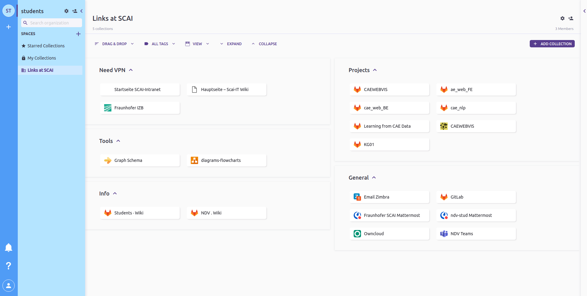

## First day

- Meet **Kathrin** get the login details (WASA, ZIMBRA, SIGMA, MATTERMOST, Gitlab)
- Login to your account (WASA) from PC in the student room
- Login to your Zimbra (Mailbox)
- **Request IT for Gitlab activation**
- **Get the student room key** (in case of contract extension needs to reset the access)
- **Apply for ID-card**
- Suppervisor ask Prof. Jochen (Mail) to add in NDV GitLab after your Gitlab is activated and be added to (mattermost, Teams and mailing list)
- add to [learn from cae data](https://gitlab.scai.fraunhofer.de/ndv/research/automotive/learning-from-cae-data)
- add to mattermost chat

---

## Regular meeting
- SCAI Cafe, every 1st Monday of month 13:00-13:30
- NDV meeting, every 2nd Monday, 15:00-16:00
---

## Prerequisite

In order to work on the project in a systematic way you need to know
- Git 
- Latex
- Markdown
- Visual Studios

---

## Contact

- **IT issues**, "SCAI Trouble Ticket System" [otrs@scai.fraunhofer.de](mailto:otrs@scai.fraunhofer.de);
- **Non-technical details** like room key, filing the work timing (AZk&ZEB) and vacation, "Kathrin Viertel" [kathrin.viertel@scai.fraunhofer.de](mailto:kathrin.viertel@scai.fraunhofer.de); or "Ute Langer" [ute.langer@scai.fraunhofer.de](mailto:ute.langer@scai.fraunhofer.de);
- **Supervisor**, "Anahita Pakiman" [anahita.pakiman@scai.fraunhofer.de](mailto:anahita.pakiman@scai.fraunhofer.de)
 
---

## General

- Access to Toby, link summary!
- Add them to related GitLab project
- Follow [how to on NDV](https://gitlab.scai.fraunhofer.de/ndv/project_ndv/-/wikis/mentoring%20a%20student)
- Make a wiki on the project your working
- Make a calendar for your working time through Zimbra (third tab inside Zimbra)
- **Until you have the ID-card request Kathrin/Supervisor to provide you the gate pass**
- Ask the other student assistants in case of organizational/technical queries

#### Toby

 - Toby is the collection of links that is handy than bookmarks
 - Install toby, since you have been shared with Links to be used, you should find a similar page as shown 

#### IT

- Refer [IT page](https://it-wiki.scai.fraunhofer.de/index.php?title=Hauptseite) for queries
- Some files or links can be accessed only through a VPN
- For any issues in Laptop, activation of Gitlab contact IT, CC Anahita Pakiman 
- [Wiki](https://it-wiki.scai.fraunhofer.de/index.php?title=SCAI_Loewenburg_Cluster), accessible with VPN

#### Workt time reporting

- You should submit your working time at the end of each month
- **AZK** which is filled manually, signed, and submitted to Kathrin either Hard/soft copy
- Another is **Web-Zeb**, which is filled digitally on [sigma](https://info.fraunhofer.de/Seiten/PageNotFoundError.aspx?requestUrl=https://info.fraunhofer.de/c4/SIGMA/SWP/index.jsp)
- You should fill the time in round numbers example:- if you worked for 6hours 30minutes fill as 6.5 hours.
- Also before working for next month check ZEB that how many hours is been assigned for you for the current month.

#### WASA

This is used to login to your work account on the PC or on the laptop provided to you

#### Zimbra

This is your [mailbox](https://zimbra.scai.fraunhofer.de/) as well as contains a calendar that has to share with your supervisor

#### Mattermost

This is the [communication platform](https://mattermost.scai.fraunhofer.de/) with other colleagues and supervisor

- New Students need to be added to When at SCAI Channel on Mattermost 

#### Gitlab

- [Gitlab](https://gitlab.scai.fraunhofer.de/) contains your project and previous projects
- Remote: GitLab: You are not allowed to push code to protected branches on this project. To <https://gitlab.scai.fraunhofer.de/ndv/research/automotive/cae_web.git> ! \[remote rejected\] master -> master (pre-receive hook declined). So you created a protected branch. By default, only maintainers can submit to protected branches. You can check the settings in your project: <https://gitlab.scai.fraunhofer.de/ndv/research/automotive/cae_web/-/settings/repository>
- Always **create a separate branch and push the cod**e. Then request for merge to your 
supervisor.

#### Teams
You will be using Teams for calls and meetings. Don't chat or use it for communication apart from meetings. Regular meetings
 - SCAI cafe, every 1st monday of the month
 - NDV meeting, ususally on mondays 15:00-16:00

---

## How to work

- Add **working days to the shared calendar** (You can choose your days)
- If there is any change due to exam/some other occasion inform before a week
- Should inform for a vacation before 3 weeks, also have to **fill the vacation request form**
- Fix a **meeting at the end of your working hours** every week to report your work and plan new tasks.
  - Short documentation
  - Present your code
- Maintain a **meeting note under project wiki**, [example](https://gitlab.scai.fraunhofer.de/ndv/research/automotive/cae_nlp/-/wikis/Student/Ganesamanian-Kolappan)
- Use [KanBan](https://docs.gitlab.com/ee/user/project/issue_board.html)
- If you don't know something ask, there isn't any bad, wrong, or stupid question
- Check the mails (Zimbra) often
- If there is a technical doubt you can always ask through Mattermost to your supervisor

---

## Coding

- Use **visual studio** as IDE (python, latex, markdown)
  - **PEP8** - Style Guide for Python Code (Extension available at VS code)
  - Recommended adding on
    - Vim
    - Grammarly (Activate Grammarly to all applications)
- Variable naming for 
  - Python/other in general - snake_case
  - **Django model**
    - Name - UpperCamelCase
    - Relation - SCREAMING_SNAKE_CASE
    - Function - snake_case
- Documentation
  - Keep all software related documentation in markdown
  - Add table of contents
  - Try to keep in bullets to follow sequentially
  - Add pictures where ever possible
  - Provide references if it's been taken from another location
  - Have a separate code block for the code session
  - Keep the README.md up to date, A good [example](https://gitlab.scai.fraunhofer.de/ndv/stud/hahner) of documentation and structuring work.
  - [Conventionalcommits](https://www.conventionalcommits.org/en/v1.0.0/)
  - Push the code at the end of each working day at our [repo](https://gitlab.scai.fraunhofer.de/ndv/stud/info-desk/-/wikis/how-to-structure-your-repo)/the repo you have been asked to.
  - The documentation should help other people to replicate your work easily
- Summary of **useful commands** [link](https://gitlab.scai.fraunhofer.de/anahita.pakiman/mission-statement/-/wikis/Tools/Shortcuts)

---

## Latex

**keep documentation and code in separated [git submodules](#git-submodule)**

[Project sample](https://gitlab.scai.fraunhofer.de/anahita.pakiman/wavelet_pooling_paper) Rename the paper.tex file into your paper name. Follow the steps below:
- Make sure you use a neat Text IDE:
  - <https://marketplace.visualstudio.com/items?itemName=James-Yu.latex-workshop>
- add the .gitignore, a sample [gitignore file](https://gitlab.scai.fraunhofer.de/anahita.pakiman/wavelet_pooling_paper/-/blob/master/.gitignore) for latex
- Use a good spell checker:
  - Academic Writing Check: <https://github.com/devd/Academic-Writing-Check>
  - Grammarly: <https://marketplace.visualstudio.com/items?itemName=znck.grammarly>
- Use GIT for version control.
- Make sure your Makefile is working correctly and compiles the documents, sample for [Makefile](https://gitlab.scai.fraunhofer.de/anahita.pakiman/wavelet_pooling_paper/-/blob/master/Makefile). Change the TARGET to the name of your main txt file
- All images go to the subfolder img.
- Make sure the source files for images are in the pics folder as well (unless they are huge)
- Place the reviews as txt files in the folder reviews.
- Place related work pdfs into the folder related work using the bitex key as the filename.
- Use your initials to comment in the tex file i.e. \\LV{Arent we missing X here?}

### git submodule
* Make sure a new git repo already exist that will hold the content of the new submodule, for example, we'll be using "git@github.com:/newemptyrepo"
* Navigate to the directory you're modulizing:`cd myproject/submodule-dir`
* Remove the to-be submodule from the parent's index:`git rm -r --cached .`
* Init a new git repo inside the to-be submodule: `git init`
* Set up the origin for the to-be submodule and make your first commit:
```
     git remote add origin git@github.com:/newemptyrepo
     git add . && git commit && git push --set-upstream origin master
```
* Now you must navigate to the parent repo's top-level path:`cd .. && cd `git rev-parse --show-toplevel`
* Finally, add the submodule as you would normally: `git submodule add git@github.com:/newemptyrepo ./myproject/submodule-dir`
* Now commit & push the changes the above command makes and you're all set up!
* git submodule foreach git push origin master
---

## Frontend Developer

- If you are going to install npm packages from [arty](https://arty.scai.fraunhofer.de/)
you should ask IT for permission to access npm-local.

#### IDEAS ON HOW TO WRITE A NICE PAPER

Refer [Link](https://github.com/mnielsen/notes-on-writing/blob/master/notes_on_writing.md) setup in vscode, [hint](url)
