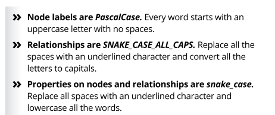
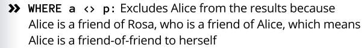
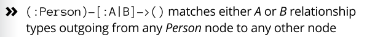
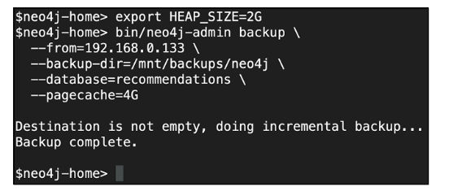

**CHAPTER 1** - Introducing Graph Databases 
- Graph databases have been the fastest growing database technology for almost a decade. A graph database uses highly interlinked data structures built from nodes. The key to understanding when to use a graph database is the value of links. Conversely, if your data is bulk storage, blob storage, time-series, or logs, then a graph may not be the best choice because there aren’t many links between the data to exploit.
- graphs offer superior querying of complex models,
- graph databases also have abstractions that can help minimize complexity.

**Labeled Property graph**

- enforcing constraints, you may want to structure how the graph evolves. 

- the approach that data should grow organically where it can, and be constrained where it must. We call it less-schema rather than schema-less.
- If you read from a node along an outgoing relationship to another node, you get a sensible sentence.
---
**CHAPTER 2** - Building Rich Graph Data Models
- Graph models are easily understood by humans, and that is a big part of what makes graphs so powerful.
- Easily refine the model by focusing on the added-value questions to which you want answers
- (indirect) connections — known as paths — through the graph.
- Patterns are where hidden value lies, obscured from sight by other
data models, but for graph models, it is just a few hops away.

- refine it by answering questions from your domain experts.
---
**CHAPTER 3** - Importing Graph Data into Your Graph
- **import data to model**, start small-scale later, get rid of duplicates, 
- massive duplication and little connectivity — sure signs of a poor graph.

**CSV import**
- If MERGE finds existing matches, it leaves them alone. If no matches are found, MERGE creates new elements in the database.
- For this reason, we recommend having several MERGE statements with smaller patterns
- Offline CSV import is fast
- For each import file, you must also create a header file that describes the structure of the corresponding node/relationship file.
- It will also completely replace the structure and data of any existing database that you may already have in place.

---
**CHAPTER 4** - Querying Your Graph
- MATCH
- `MATCH (a:Person {name:'Alice'})-[:FRIEND_OF*1..2]->(p:Person)` or `-[:FRIEND_OF*2]->.`

- OPTIONAL MATCH uses an empty space for missing parts of the pattern, takes more time to process
- more specific you can make a pattern the better.

- SET: Allows you to change or add a property.
- REMOVE: Does the opposite of SET
- DETACH DELETE, which removes the entire matched pattern and any dangling relationships (so use it carefully).
**Predecates**, Predicates are functions that return true or false
- can use them to reduce the search space,
- EXISTS/NOT: `WHERE a <> b AND EXISTS/NOT ( (b)-[:MARRIED_TO]-(:Person) )`
- NONE: no matches at all will be returned if any of the social network members are minors `WHERE a <> b AND
NONE (x IN nodes(b) WHERE x.age < 21)`
**Aggregating**
- count, avg, min, max
- reduce: `RETURN reduce(totalAge = 0, n IN nodes(p)|totalAge + n.age) AS totalAges`
**Returning**
- ORDER BY p.age ASC/DESC, LIMIT
 
---
**CHAPTER 5** - Using Graphs in Production with Neo4j
- Core Servers process transactions and are responsible for keeping your data safe. highly resilient cluster may need nine servers across three data centers
- add Read Replicas to the cluster to scale out operations like analytics or reporting workloads.
**Performing Regular Backups**,

**Integrating with Other Systems Graph**
- ETL
- Streaming, your graph can be updated in response to a variety of events received from around your enterprise. 
Apache Kafka

---
**CHAPTER 6** - Ten Tips for Creating Successful Graphs
- query-ing paths, trees, or networks, then a graph  database will make your life easier.
- graphs work best where you have a lot of connections and where you can derive useful insights from these connections.
- Begin with Modeling
- Start Small, Scale Next
- Model for Questions, 
- Graphs are most valuable when you use them to find patterns and make predictions about the future dynamics of the network.