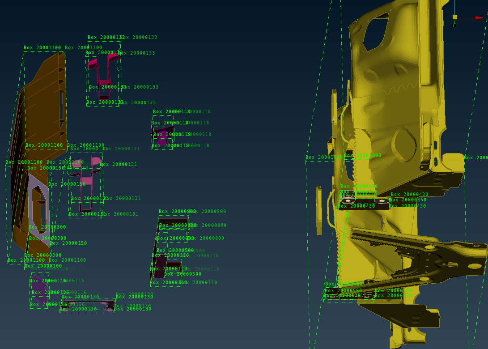
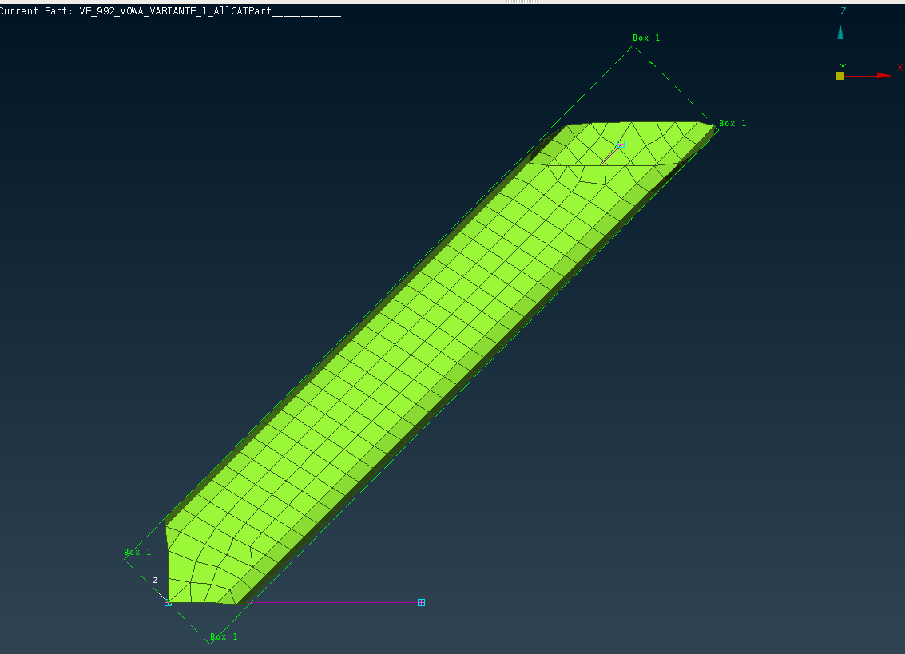
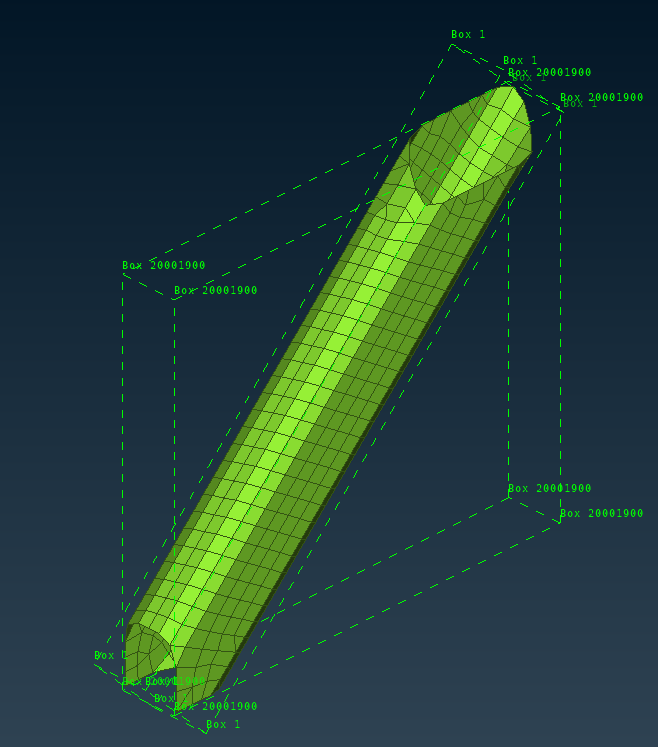
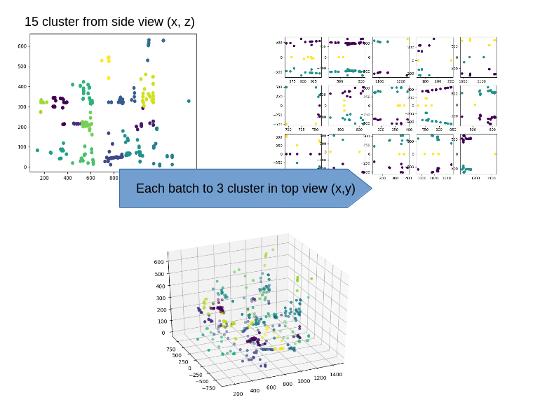
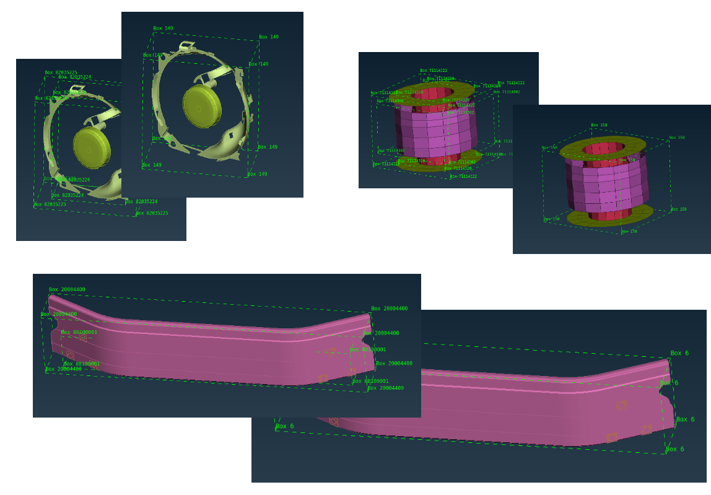
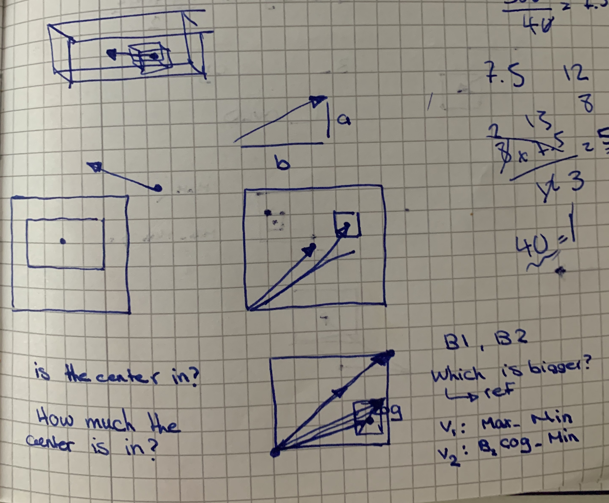
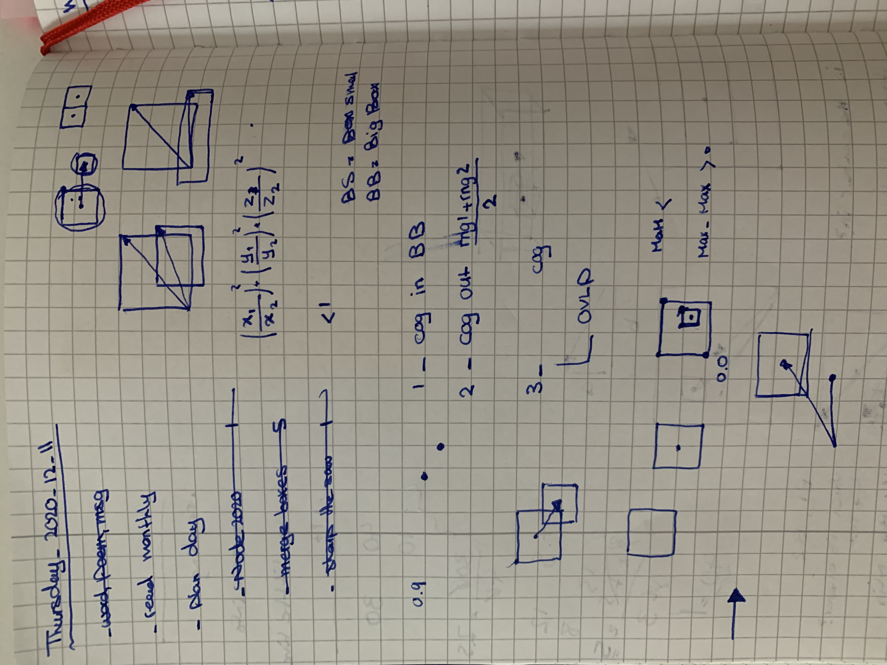

#### Boxes
- get node cordinate range
- make box from the range

- [ ] make longitudinal boxes
        - dyna box options
        - use local coordinate sys option, sample `/home/apakiman/kg01/box_local.k`

        
        
- generate parts box as a key file
- wait with refining boxes until knowing more what kind of questions they are going to answer

- [ ] look into boxes in deformation
- [ ] save box info to neo4j, update_part

#### Merge Boxes
- comparison iteration
  - xz and xy plane cluster

compare B1 and B2, if < B1 is bigger: ref
- sort box based on cog
- remove nonshell parts, KG.make_box()
- C : cog_b1 - cog_b2
- if1 : C < rng_B1 : merge

-[ ] if2 : rng_B1 < C < (rng_B1 + rng_B2)/2 : ignore
-[ ] else: overlap pct: 
  - v1: MaxB1 - MinB1
  - v2: MaxB2 - MinB1
  - OVLP: v2/v1
  - if OVLP > thld:
        merge boxes min(minb1, minb2), max(maxb1, maxb2)

- make box_merge.k

