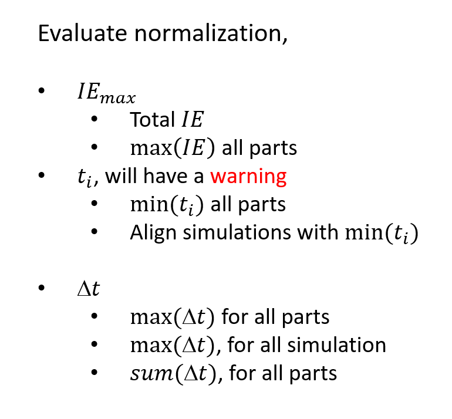
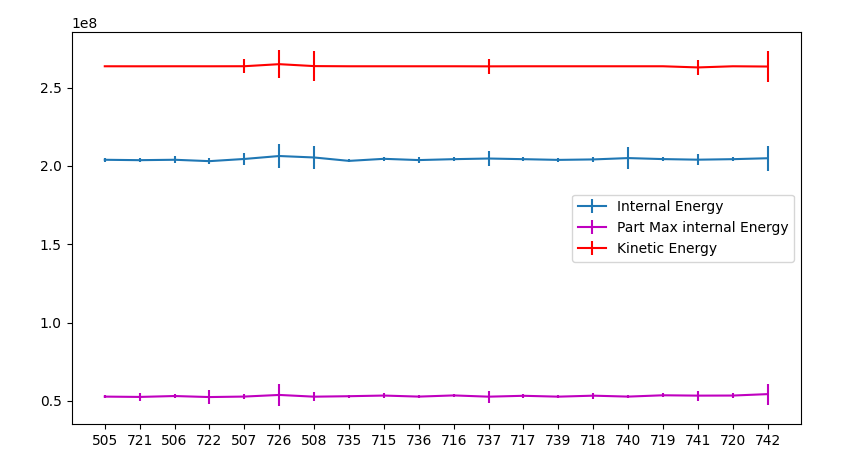
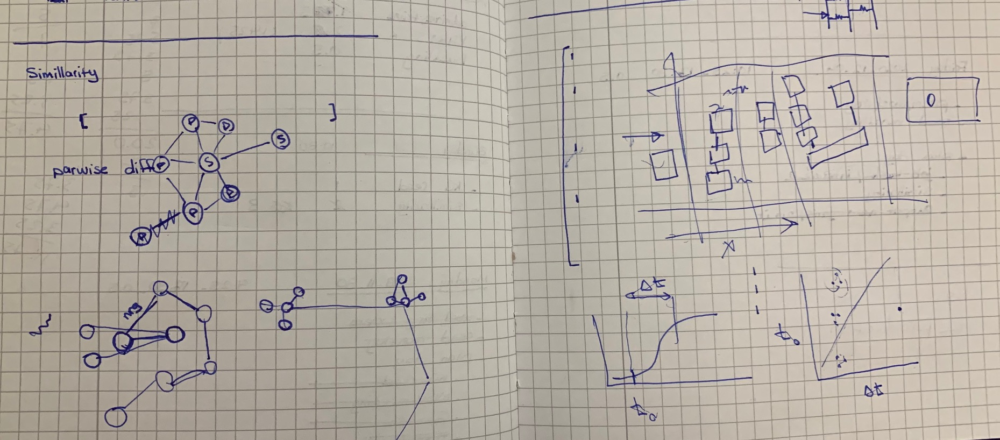

# Energy Embedding
## Normalize the Features
  - how the normalization should be stored on the graph#
    - store the normalization scales, in simulation level
    - make functions for combining different scales

  

  **NOTE** for ti since min can be 0, range of ti will be considered

  - for evaluating tn_pct for all, the 0 curves should be removed
  - update the graph with new features

  - how to store cypher query
    - use python
  - [report](./energy_norm.ipynb),


  - load kinetic energy, difference in matsum an glstat, but less deviation of this difference for kinetic enrgy compare to internal energy

    - anomally detection: no dev in kinetic but dev in internal energy
    - get mass/velocity range of the models,




```
grep 'physical mass'  */OUTPUT/Design*.o*
grep 'x velocity'  */OUTPUT/Design*.o*
grep 'initial kinetic energy '  */OUTPUT/Design*.o*
```

- benchmark normalization
  - use Kinetic Energy for max


  - Normalize function, get the normalization method and return three energy features

  - how to query simulations that should be analyzed
    - add measure for similar naming of simulations
    - get regex input
    - get list

## Evaluate similarity
 - consider all the parts
  - [ ] group parts based on dt-t0 with new event node
  - [ ] connect grouped part in sequence of t0, with absorption link
  - [ ] weigh the absorption link with energy
  - [ ] search for similar simulation with graph algo


  
