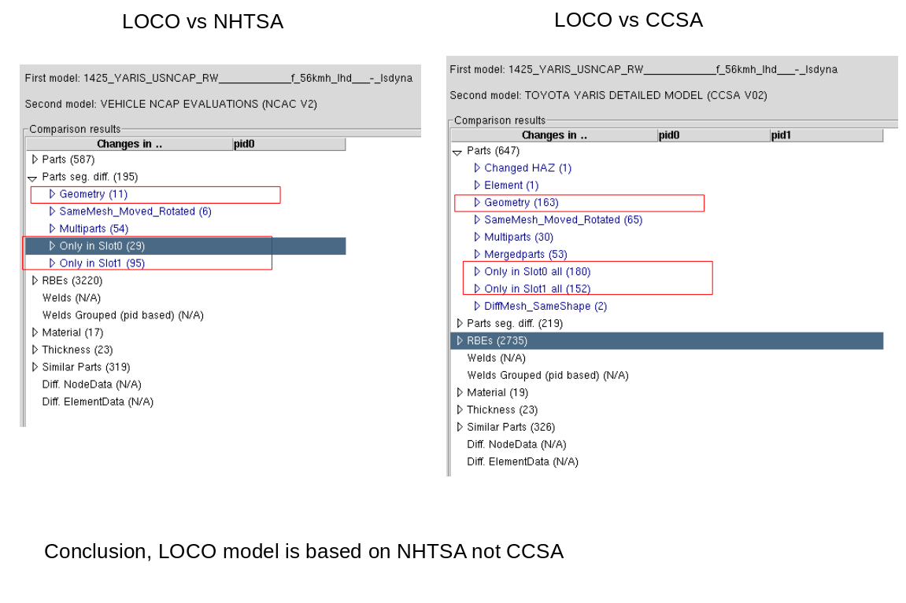

# YARIS DOE Setup
## Model Info
- NCAC DYNA MPP971sR4.2.1, [link](https://media.ccsa.gmu.edu/cache/NCAC-2011-T-001.pdf)
- CCSA DYNA mpps R6.1.2, [link](https://www.ccsa.gmu.edu/models/2010-toyota-yaris/)
- /home/apakiman/Nextcloud/Projects/carGraph/runs/yaris
- LOCO ref 1425(missing mas)
  - 1458, not available in the pool

### Unit System

| MASS	| LENGTH	| TIME	|	FORCE	|	STRESS	|	ENERGY	|	DENSITY	|	YOUNG's	|	35MPH / 56.33KMPH	|	GRAVITY	|
| ------ | ------ |  ------ | ------ | ------ | ------ |  ------ | ------ | ------ | ------ | 
| ton |	mm |	s |	N |	MPa |	N-mm |	7.83e-09 |	2.07e+05 |	1.56e+04 |	9.806e+03 |

```
for s in *; do grep 'estimated total cpu time' -A 4 $s/slu*; done
for s in *; do echo $s;tail $s/slu*; done
```
1 node:
LOCO:    6-7 hr     time 100ms
CCSA:    26-27 hr   0.2 s
NHTSA:   18-19hr    0.2 s

15 node:
LOCO:    0-1 hr
CCSA:    3-4 hr failed, due to negative volume of solids
NHTSA:   2-3hr

10 node: (~/dyna.sh 14400 10),  ~/dyna.sh 14400 10
LOCO:    0-1 hr
CCSA:    3-4 hr 
NHTSA:   2-3hr

| Model| Total Mass d3hsp | Added Mass | FE Reported Mass |
| ------ | ------ |  ------ | ------ |
| LOCO | 1180.0 | 12.7 | |
| CCSA | 1253.7 | 13.3 | 1263
| NHTSA | 1253.5 | 13.3 ||

Axel info:
total mass of 1253  
kg and a BIW of 480 kg. zhe BIW model (Yaris-EEGO)

## Compare 3 Models Result

## Chnages to CCSA model
- termination time from 0.2s to 0.13s
- d3plot 0.01 -> 0.001
- matsum 0.001 -> 0.0001



## Target
- Generate simulations for front impact

### Barrier Info
- 1st full front to rigid wall
- or have it same as PAG, EURO NCAP: ODB 64 km/h, 40% overlap

### DOE Requirements
- diverse 
- have distinguishable(?) permutation in rhe 20(?) first energetic part


### Available Studies
- look in to doe studies to use their model


### Work Flow
- use head impact setup, [link](https://gitlab.scai.fraunhofer.de/anahita.pakiman/mission-statement/-/issues/48)

- run full front on leo 
- look in loco reference model-1458
- summerize different Yaris model and dyna version
- [ ] compare mass
- [ ] can I run ANSA on leo

#### choose component to morph
  ##### mass distribution
  - engine 150-300
  - loco model too light, 769 kg, strange material on the rigid wall
  - NHTSA model, 1.037 ton, (ton |	mm |	s |	N |	MPa |	N-mm |	7.83e-09 |	2.07e+05 |	1.56e+04 |	9.806e+03), [link](https://www.dynasupport.com/howtos/general/consistent-units)
  - real car 960-1115 kg 
  - [CSSA](https://www.ccsa.gmu.edu/models/2010-toyota-yaris/), 1040 


| PAG biggest include size | YARIS loco BIW | CCSA combined model |
| ------ | ------ | ------ |
| 25 M | 63 M | 162 M |


##### Structural
 - bumper
 - BIG
 - front axel
